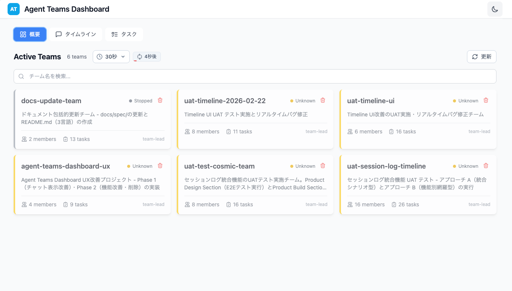
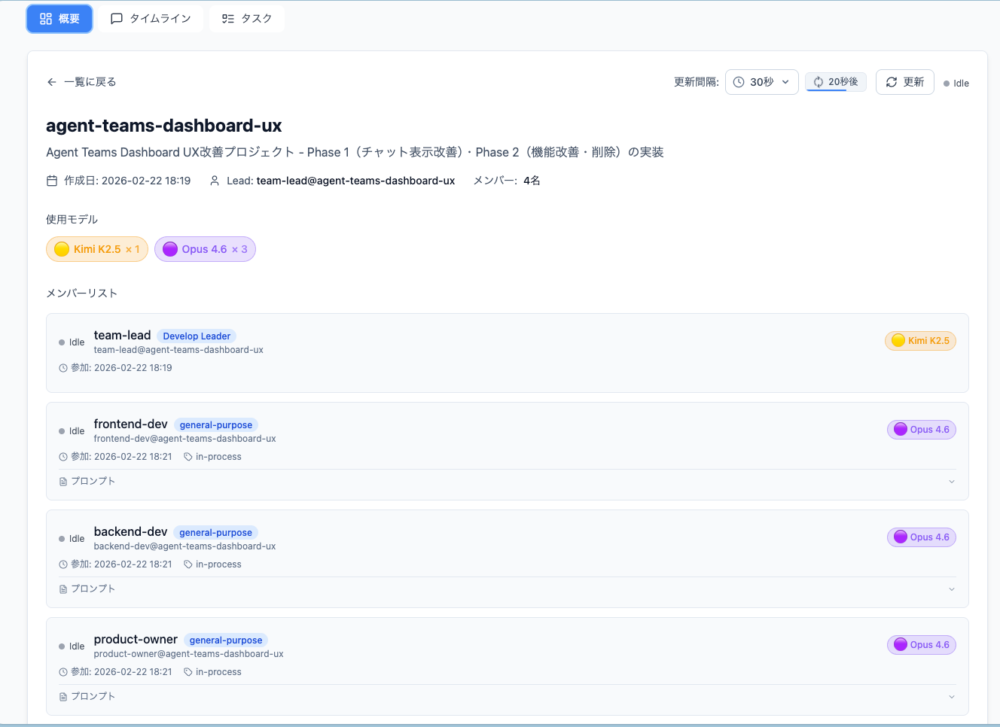
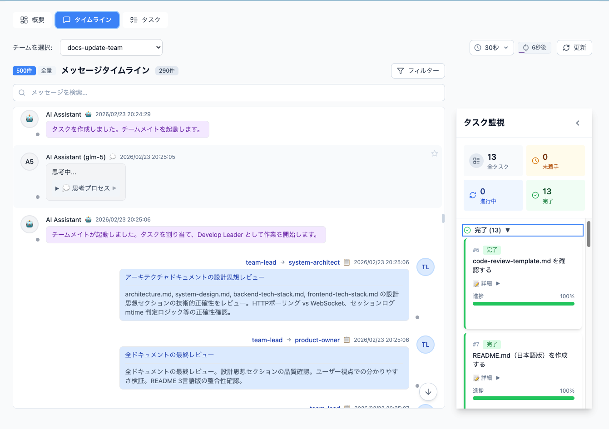
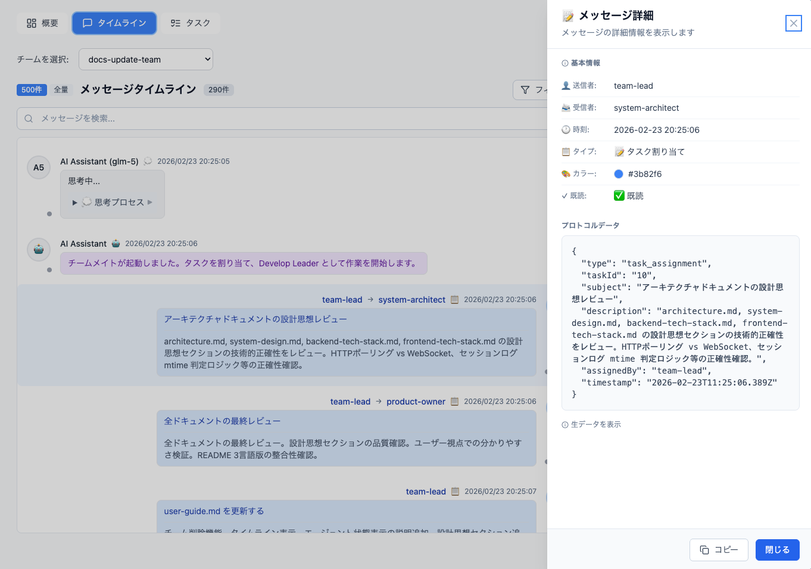
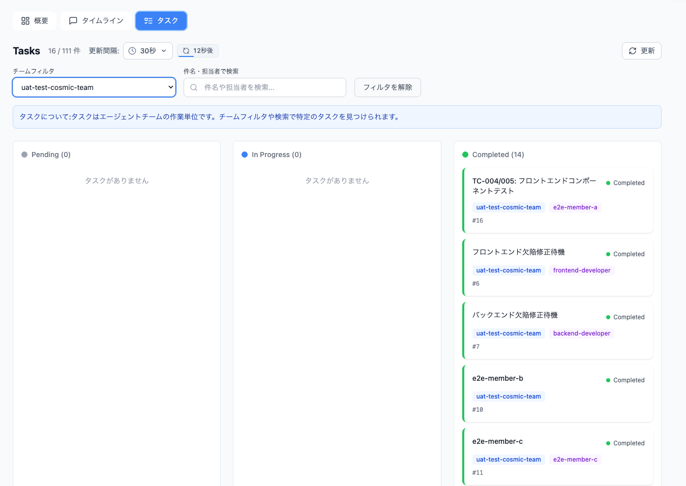

# Agent Teams Dashboard

Real-time monitoring dashboard for Claude Code Agent Teams

[](LICENSE)
[](https://www.python.org/)
[](https://react.dev/)
[](https://fastapi.tiangolo.com/)

---

## Languages / 语言

- [日本語](README.md) (Default)
- [English](README.en.md)
- [中文](README.zh.md)

---

## Overview

Agent Teams Dashboard is a web application for real-time monitoring and management of Claude Code's Agent Teams feature. It monitors the `~/.claude/` directory and visualizes team configurations, task progress, and inter-agent messaging.

### Key Features

- **Real-time Updates**: Automatic data updates via HTTP Polling (5s-60s intervals)
- **Team Monitoring**: Display active agent teams with status indicators
- **Task Management**: Visualize tasks by status (Kanban-style)
- **Unified Timeline**: Integrated display of agent messages + session logs
- **Dark Mode**: Theme switching support

---

## Quick Start

### Prerequisites

| Software | Version | Check Command |
|----------|---------|---------------|
| Python | 3.11+ | `python --version` |
| Node.js | 18+ | `node --version` |
| npm | 9+ | `npm --version` |

### Installation

```bash
# Clone repository
git clone <repository-url>
cd cc-agent-teams-action-monitor

# Backend
cd backend
pip install -e ".[dev]"

# Frontend
cd ../frontend
npm install
```

### Starting the Application

**Terminal 1 (Backend):**
```bash
cd backend
uvicorn app.main:app --reload --host 127.0.0.1 --port 8000
```

**Terminal 2 (Frontend):**
```bash
cd frontend
npm run dev
```

**Access:** http://localhost:5173/

---

## Screenshots

### Dashboard Overview



Main dashboard showing active teams and their status indicators.

### Team Detail View



Click on a team to view detailed information including members and session status, and Agent activity.

### Timeline View



Unified timeline showing agent messages and session logs in an integrated view.

### Message Detail View



Click on a message to view its full content and metadata.

### Task Management (Kanban)



Kanban-style task management with columns for Pending / In Progress / Completed.

---

## Design Philosophy

### Why HTTP Polling?

This system uses **HTTP Polling instead of WebSocket**:

1. **Simple Architecture**: No WebSocket connection management required
2. **Cache Utilization**: TanStack Query's caching (staleTime: 10s) reduces unnecessary requests
3. **Scalability**: Polling interval is user-adjustable

### Team Status Determination

Team status is determined by **session log mtime**:

| Status | Condition | Can Delete |
|--------|-----------|------------|
| `active` | Session log mtime ≤ 1 hour | ❌ No |
| `stopped` | Session log mtime > 1 hour | ✅ Yes |
| `unknown` | No session log | ✅ Yes |
| `inactive` | Empty members array | ✅ Yes |

> See [docs/spec/system-design.md](docs/spec/system-design.md) §2.2 for details

---

## 📚 Documentation Reference

For detailed information, refer to the documents in `docs/spec/`:

| Document | Content |
|----------|---------|
| [architecture.en.md](docs/spec/architecture.en.md) | Architecture design, component structure, data flow |
| [system-design.en.md](docs/spec/system-design.en.md) | System design, API specifications, data models |
| [frontend-tech-stack.en.md](docs/spec/frontend-tech-stack.en.md) | Frontend technology stack details |
| [backend-tech-stack.en.md](docs/spec/backend-tech-stack.en.md) | Backend technology stack details |
| [feature-specification.en.md](docs/spec/feature-specification.en.md) | Feature specification details |
| [user-guide.en.md](docs/spec/user-guide.en.md) | User guide details |
| [ut-plan.en.md](docs/spec/ut-plan.en.md) | Unit test plan |
| [qa-strategy.en.md](docs/spec/qa-strategy.en.md) | QA strategy |
| [uat-test-cases.en.md](docs/spec/uat-test-cases.en.md) | UAT test cases |
| [code-review-template.en.md](docs/spec/code-review-template.en.md) | Code review template |

---

## Tech Stack

### Backend

| Category | Technology |
|----------|------------|
| Language | Python 3.11+ |
| Framework | FastAPI 0.109+ |
| Data Validation | Pydantic 2.5+ |
| File Watching | watchdog 4.0+ |

### Frontend

| Category | Technology |
|----------|------------|
| Language | TypeScript 5.3+ |
| Framework | React 18 |
| Bundler | Vite 5+ |
| CSS | Tailwind CSS 3.4+ |
| State Management | Zustand 5.0.2+ |
| Data Fetching | TanStack Query 5.90.21+ |

> For detailed version information, see [docs/spec/frontend-tech-stack.en.md](docs/spec/frontend-tech-stack.en.md) and [docs/spec/backend-tech-stack.en.md](docs/spec/backend-tech-stack.en.md)

---

## API Overview

### Main Endpoints

| Endpoint | Method | Description |
|----------|--------|-------------|
| `/api/health` | GET | Health check |
| `/api/teams` | GET | Team list (with status) |
| `/api/teams/{name}` | GET | Team details |
| `/api/teams/{name}` | DELETE | Delete team (non-active only) |
| `/api/tasks` | GET | Task list |
| `/api/timeline/{name}/history` | GET | Unified timeline |
| `/api/timeline/{name}/updates` | GET | Incremental updates |

> For complete API specifications, see [docs/spec/system-design.md](docs/spec/system-design.md) §6

---

## Development Commands

### Backend

```bash
cd backend

# Start development server
uvicorn app.main:app --reload

# Run tests
pytest                    # All tests
pytest --cov=app          # With coverage
pytest tests/test_api_teams.py -v  # Individual test
```

### Frontend

```bash
cd frontend

# Start development server
npm run dev

# Type check
npx tsc --noEmit

# Run tests
npm run test
npm run test:coverage     # With coverage

# Production build
npm run build
```

---

## Troubleshooting

| Issue | Cause | Solution |
|-------|-------|----------|
| Teams not displayed | `~/.claude/teams/` is empty | Create a team in Claude Code |
| HTTP connection error | Backend stopped | Restart the backend |
| Page not loading | Frontend not started | Run `npm run dev` |
| Real-time updates not working | Port blocked | Check firewall settings |

> For details, see [docs/spec/user-guide.md](docs/spec/user-guide.md) §Troubleshooting

---

## Environment Variables

| Variable | Default | Description |
|----------|---------|-------------|
| `DASHBOARD_HOST` | `127.0.0.1` | Server listen address |
| `DASHBOARD_PORT` | `8000` | Server listen port |
| `DASHBOARD_DEBUG` | `True` | Debug mode |
| `DASHBOARD_CLAUDE_DIR` | `~/.claude` | Claude data directory |

---

## Contributing

Contributions are welcome!

### Getting Started

1. Fork this repository
2. Create a feature branch (`git checkout -b feature/amazing-feature`)
3. Commit your changes (`git commit -m 'Add amazing feature'`)
4. Push to the branch (`git push origin feature/amazing-feature`)
5. Open a Pull Request

### Development Setup

```bash
# Backend
cd backend
pip install -e ".[dev]"
pytest --cov=app  # Run tests

# Frontend
cd frontend
npm install
npm run test:coverage  # Run tests
```

### Coding Standards

- **Python**: Follow PEP 8, format with Ruff
- **TypeScript**: Format with ESLint + Prettier
- **Commit Messages**: Use Conventional Commits format

---

## Roadmap

### v0.1.0 (Current)

- [x] Real-time updates via HTTP Polling
- [x] Team monitoring and status detection
- [x] Task management (Kanban-style)
- [x] Unified timeline (inbox + session logs)
- [x] Dark mode support

---

## License

MIT License

---

*Last Updated: 2026-02-24*
