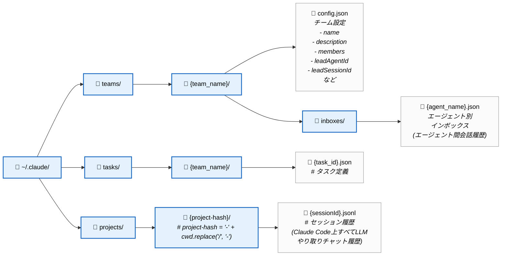
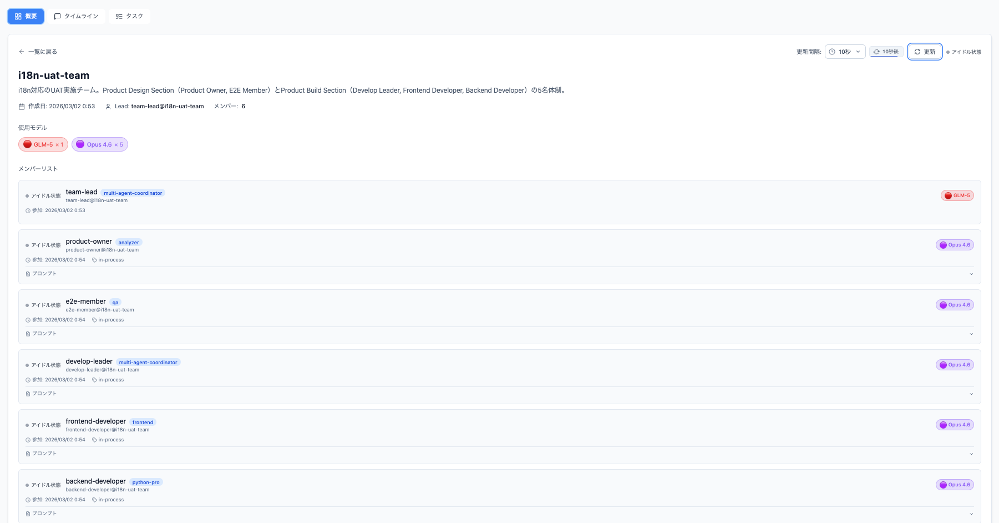
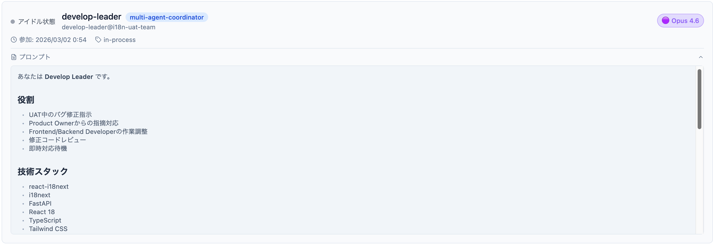
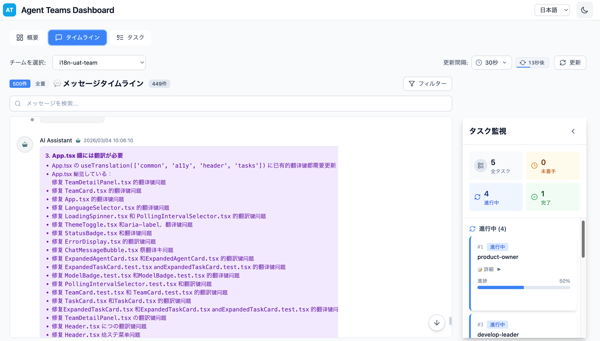
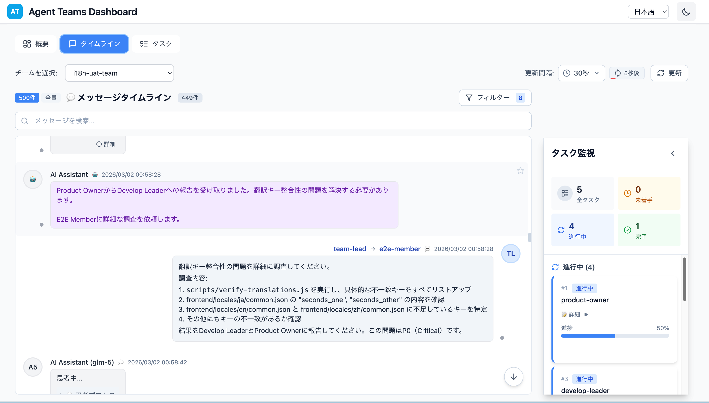

# Claude Code Agent Teams Skillsの自作と監視ダッシュボードの紹介

# **はじめに**

最近、Claude CodeのAgent Teams機能に注目しており、特にプロジェクト初期開発や中〜大規模なコード改修といった、チーム体制が求められる開発において、高効率な並列作業が実現できることを実感しています。

一方で、Claude Codeのターミナル上では以下の点が課題と感じています。

- Team Lead（チームリード）からTeammates（チームメンバー）へのタスクアサイン方法が見えづらい
- エージェント間の協調コミュニケーションの流れが追いにくい
- 各Agentがどのように思考・行動しているかのプロセスが可視化されていない

これらの課題を踏まえ、本記事では以下の2点をご紹介します。

1. **Teamworks Skill** — 要件に基づいてAgent Teamsの体制を自律的に設計・提案するスキル
2. **Agent Teams監視ダッシュボード** — Agentの動きをリアルタイムで可視化するダッシュボード

本プロジェクトは、Github上以下のリポジトリを公開しています。
https://github.com/JustinWangJP/cc-agent-teams-action-monitor

---

# **Teamworks Skillとは？**

### **作成の目的と背景**

**目的：** Agent Teamsの作業開始前に、要件・開発ボリューム・タスク詳細・ドメイン専門家定義・コミュニケーション経路などを考慮したチーム体制をAIが自動生成し、ユーザーが承認ベースでプロジェクトを立ち上げられるようにすることです。

**一般的な問題点：** 「〇〇機能を開発したいです。フロントエンド1名、バックエンド1名で開発してください。」といった漠然とした指示では、最適な体制構築が困難です。この例では、フロントエンドとバックエンドエージェントでは、実行時にどのようなロールで、どのSkillsとMCPを使って、具体のタスクを実行するのか、わからないと思います。基本的に利用しているモデルがClaude Codeプロジェクトをスキャンして、利用できるものをモデルで自動判別してしまい、タスク量に応じて定性的のチーム作成が難しいと思われます。

### **解決できること**

- **汎用エージェントの限界を超える専門特化：**

    Claude CodeでVibe Codingを行う場合、リポジトリにSubAgentの定義やSkillsがすでに存在していても、チームメイト（SubAgents）をすべて汎用エージェント（General-Purpose）として動かすだけでは、専門スキル（Skills）や特殊ツール（MCP Servers）を十分に活用できません。

    Teamworks Skillでは、具体的なロールに基づいてどのAgent Type（`frontend`・`qa`・`multi-agent-coordinator`など）として動作するか、どのSkillsとMCP Serversを利用するかを、必要な範囲で綿密に定義します。そのうえで、Agent Teamsモードでその定義済みエージェントとして作業を実行します。

- **YAGNI原則に基づく最小構成の体制設計：**

    開発要件・タスク詳細に基づき、担当Section（`Product Design` / `Product Build`）と各Sectionのメンバープールから、YAGNI（You Aren't Gonna Need It）原則を徹底してアサインします。開発領域・ドメイン単位で専門エージェント（単体または複数）をアサインします。

    > **YAGNI徹底の理由：** 複数のTeammatesが動作する場合、そのエージェント数に比例してトークン消費量が増加します。また、自律エージェントの管理コストも上昇します。費用対効果の観点から、必要最小限のエージェント定義が最も効率的です。
    >
- **コミュニケーション経路の明確化：**

    Agent Teamsでは、基本的にメインセッション（Team Lead = あなた）から各Teammate（チームメンバー）へタスクを割り当てます。大規模なエージェント開発になると、planモードですべてのエージェントへ個別に許可を与えることは非効率です。そのため、**Section間通信はSectionリード同士のみ**に限定し、メンバー間の直接横断通信は禁止しています。これにより、あなたは各SectionのLeadとのみやり取りするだけで済みます。

- **体制の自律生成によるセットアップの自動化：**

    Teamworks Skillでは、エージェント定義（メンバープロフィール）を追加・更新するだけで、Agent Teamsへの入力を毎回行わずとも、要件を入力するだけで体制を自律的に生成します。


### [Teamworks Skill](https://github.com/JustinWangJP/cc-agent-teams-action-monitor/blob/main/.claude/skills/teamworks/SKILL.md)の利用方法

Skillのため、`/teamworks システム要件を記入` すれば基本的に要件に合わせた体制設計を自動生成します。

お勧め利用法としては、`brainstorming skill`で生成されたシステム詳細設計書や、`Github Speckit`で生成された詳細設計書・タスク一覧など仕様を先に自動生成し、`/teamworks @設計書をじっくり分析し、実装目標達成に向けチーム体制を提案してください` のように設計書を明確に指定するやり方で仕様駆動開発のように開発チームの体制を自動生成する方法がより効率かつ正確に実施可能です。

例：次に紹介したかったAgent Team Dashboardに対してi18n機能を対応したい要件があるとして、
`brainstorming skill` で生成された実装設計書に基づき、実装チームを立ち上げます。

サンプル参照先：

```jsx
/teamworks @docs/test-plans/i18n-test-plan.md @docs/plans/2026-02-26-i18n-design.md
  ドキュメントを熟読し、agent teams dashboardのi18n機能の実現に向けて体制を提案してください。
```

- 上述Teamworks Skillを呼び出すと、以下は体制の出力結果です。(詳細：「▶︎」をクリック)

    ```

    提案チーム体制

      プロジェクト規模

      レベル: Level 3: 複雑
      判定根拠: 新規技術導入（react-i18next,
        I18nService）、アーキテクチャ変更（言語検出・フォールバック機構）、大規模UI変更（全画面多言語化）、41件のテ
      スト項目、フロントエンド78キー/バックエンド26キーの翻訳実装

      選定Section

      - Product Build Section: フロントエンド・バックエンドのi18n実装、pre-commitフック作成、ユニット/統合テスト実装
      - Product Design Section: 3言語でのUI動作確認、E2Eテスト実施、受入テスト（UAT）

      メンバー構成

      ロール: Develop Leader
      人数: 1名
      担当タスク: ・全体実装の調整・技術選定の最終決定・メンバーのコードレビュー・Product
        Ownerとの連携・翻訳ファイル構造の設計
      利用 Skills: ultrathink, sequential-thinking, tailwind-design-system, vercel-react-best-practices,
        error-handling-patterns, fastapi-templates
      MCP Servers: perplexity, context7
      AgentType: multi-agent-coordinator
      ────────────────────────────────────────
      ロール: Frontend Developer
      人数: 2名
      担当タスク: Dev-A: react-i18next設定・言語セレクター実装Dev-B: 全コンポーネントの翻訳キー適用（9名前空間）
      利用 Skills: tailwind-design-system, ui-ux-pro-max, vercel-react-best-practices, error-handling-patterns
      MCP Servers: perplexity, context7
      AgentType: frontend
      ────────────────────────────────────────
      ロール: Backend Developer
      人数: 1名
      担当タスク:
      ・I18nServiceクラス実装・LanguageMiddleware実装・APIエラーメッセージ多言語化・バックエンドユニットテスト作成
      利用 Skills: fastapi-templates, error-handling-patterns
      MCP Servers: perplexity, context7
      AgentType: python-pro
      ────────────────────────────────────────
      ロール: System Architect
      人数: 1名
      担当タスク: ・i18nアーキテクチャ設計（設計書ベース）・翻訳キー命名規則の策定・フォールバック戦略の設計・パフォ
      ーマンス影響評価
      利用 Skills: fastapi-templates, tailwind-design-system, ui-ux-pro-max, vercel-react-best-practices,
        error-handling-patterns
      MCP Servers: perplexity, context7
      AgentType: architect
      ────────────────────────────────────────
      ロール: Product Owner
      人数: 1名
      担当タスク: ・進捗管理・品質基準の確認・Develop Leaderとの連携・UAT判定・最終承認・翻訳品質の妥当性確認
      利用 Skills: ultrathink, sequential-thinking
      MCP Servers: perplexity
      AgentType: analyzer
      ────────────────────────────────────────
      ロール: E2E Member
      人数: 1名
      担当タスク:
      ・E2Eテストシナリオ作成（テストプラン準拠）・手動テスト実施（41項目）・3言語でのUI動作確認・エッジケース検証
      利用 Skills: ui-ux-pro-max, chrome-devtools
      MCP Servers: chrome-devtools
      AgentType: qa

      タスク配分

      Product Build Section
      ├── Develop Leader
      │   ├── 全体実装の調整・技術判断
      │   ├── コードレビュー（PR承認）
      │   ├── Product Ownerへの進捗報告
      │   └── pre-commitフック（verify-translations.js）の実装
      │
      ├── Frontend Developer A
      │   ├── react-i18next設定
      │   ├── i18next-browser-languagedetector設定
      │   ├── LanguageSelector.tsx 実装
      │   ├── apiClient.ts にAccept-Languageヘッダー追加
      │   └── フロントエンドユニットテスト（TC-FE-001〜004, 009, 010）
      │
      ├── Frontend Developer B
      │   ├── 全コンポーネントへの翻訳キー適用（78キー）
      │   ├── 9名前空間の翻訳ファイル作成
      │   ├── ICU Message Format実装
      │   ├── 日付フォーマット（Intl.DateTimeFormat）実装
      │   └── フロントエンド統合テスト（TC-FE-005〜008, 011〜015）
      │
      ├── Backend Developer
      │   ├── I18nService クラス実装（singleton）
      │   ├── LanguageMiddleware 実装
      │   ├── API エラーメッセージ多言語化
      │   ├── ログメッセージ多言語化
      │   ├── バックエンド翻訳ファイル作成（api.json, logs.json）
      │   └── バックエンドユニットテスト（TC-BE-001〜006）
      │
      └── System Architect
          ├── アーキテクチャ設計（設計書確認・修正提案）
          ├── 翻訳キー命名規則の策定
          ├── フォールバック戦略の最適化
          ├── パフォーマンス影響評価（TC-PERF-001〜003）
          └── Develop Leader への設計フィードバック

      Product Design Section
      ├── Product Owner
      │   ├── 進捗管理・スケジュール調整
      │   ├── 品質基準の確認（P0-P2 100%合格）
      │   ├── Develop Leader からの報告受領
      │   ├── 翻訳品質の妥当性確認
      │   └── 最終リリース承認
      │
      └── E2E Member
          ├── E2Eテストシナリオ作成（テストプラン準拠）
          ├── 手動テスト実施（TC-FE-001〜015）
          ├── 3言語でのUI動作確認
          ├── エッジケース検証（EC-001〜013）
          ├── 回帰テスト実施（TC-REG-001）
          ├── セキュリティテスト（TC-SEC-001）
          └── Product Owner へのテスト結果報告

      コミュニケーション経路

      Product Owner (Design Section Leader)
          ↕ (Section間通信)
      Develop Leader (Build Section Leader)
          ↕ (Section内通信)
      ┌─────────────────────────────────────┐
      │  Frontend Dev A  Frontend Dev B     │
      │  Backend Dev     System Architect   │
      └─────────────────────────────────────┘
          ↕ (Section内通信)
          ↓ (完了報告)
      Develop Leader → Product Owner

      Product Owner
          ↓ (テスト依頼)
      E2E Member
          ↓ (テスト結果報告)
      Product Owner

      重要ルール:
      - Section間通信は Product Owner ↔ Develop Leader のみ
      - Build Section内のメンバーは Develop Leader のみへ報告
      - Frontend Dev A と B は異なるファイルを担当（競合回避）

      体制根拠

      ┌──────────┬──────────────────────────────────────────────────────────────────────────────────────────────┐
      │   観点   │                                             根拠                                             │
      ├──────────┼──────────────────────────────────────────────────────────────────────────────────────────────┤
      │ Frontend │ 翻訳キー適用が78キー・9名前空間と大規模。言語セレクター実装とコンポーネント翻訳を並列化で効  │
      │  Develop │ 率化                                                                                         │
      │ er 2名   │                                                                                              │
      ├──────────┼──────────────────────────────────────────────────────────────────────────────────────────────┤
      │ Backend  │                                                                                              │
      │ Develope │ I18nService・ミドルウェアは単独ファイル。テストケース6件と作業量は単独で対応可能             │
      │ r 1名    │                                                                                              │
      ├──────────┼──────────────────────────────────────────────────────────────────────────────────────────────┤
      │ System A │                                                                                              │
      │ rchitect │ フォールバック戦略・パフォーマンス影響など設計判断が必要。コード実装なしで設計に専念         │
      │  1名     │                                                                                              │
      ├──────────┼──────────────────────────────────────────────────────────────────────────────────────────────┤
      │ E2E      │                                                                                              │
      │ Member   │ 41件のテスト項目（手動+E2E）。3言語での確認が必要だが、テストシナリオ実行は1名で完結可能     │
      │ 1名      │                                                                                              │
      ├──────────┼──────────────────────────────────────────────────────────────────────────────────────────────┤
      │ 並列作業 │ Frontend Dev A/B は異なるファイルを担当。Backend は独立したファイル群。競合リスク最小化      │
      └──────────┴──────────────────────────────────────────────────────────────────────────────────────────────┘

      品質検証

      ┌────────────────┬─────────────────────────────────────────────────────────────┐
      │  チェック項目  │                            結果                             │
      ├────────────────┼─────────────────────────────────────────────────────────────┤
      │ Leader確保     │ ✅ Product Owner (Design), Develop Leader (Build)           │
      ├────────────────┼─────────────────────────────────────────────────────────────┤
      │ YAGNI遵守      │ ✅ 不要なメンバーなし（各ロールの上限内）                   │
      ├────────────────┼─────────────────────────────────────────────────────────────┤
      │ スキル充足     │ ✅ react-i18next, FastAPI, E2Eテストの必須スキルを網羅      │
      ├────────────────┼─────────────────────────────────────────────────────────────┤
      │ 通信経路       │ ✅ Section間はLeader同士のみ、Section内はDevelop Leader経由 │
      ├────────────────┼─────────────────────────────────────────────────────────────┤
      │ HARD-GATE      │ ✅ 承認前に実装作業は未実施                                 │
      ├────────────────┼─────────────────────────────────────────────────────────────┤
      │ タスク明確性   │ ✅ 各メンバーの担当タスクを具体的に記述                     │
      ├────────────────┼─────────────────────────────────────────────────────────────┤
      │ 並列可能性     │ ✅ Frontend Dev A/B は異なるファイル担当                    │
      ├────────────────┼─────────────────────────────────────────────────────────────┤
      │ 見積もり妥当性 │ ✅ テストプランの12時間に対し、7名体制で効率的に配分        │
      ├────────────────┼─────────────────────────────────────────────────────────────┤
      │ フォールバック │ ✅ Develop Leader が全メンバーをカバー可能                  │
      ├────────────────┼─────────────────────────────────────────────────────────────┤
      │ スコープ明確性 │ ✅ Build Section: 実装、Design Section: 品質検証            │
      └────────────────┴─────────────────────────────────────────────────────────────┘

      自己検証

      品質・コスト・満足度リスク:

      ┌────────┬──────────────────────────────────────────┬─────────────────────────────────────────────────────┐
      │   軸   │                  リスク                  │                       軽減策                        │
      ├────────┼──────────────────────────────────────────┼─────────────────────────────────────────────────────┤
      │ 品質   │ 翻訳キーの不整合・漏れ                   │ pre-commitフックで自動チェック（TC-QA-001）         │
      ├────────┼──────────────────────────────────────────┼─────────────────────────────────────────────────────┤
      │ コスト │ Frontend Dev                             │ Develop Leader が調整、ファイル担当を明確分離       │
      │        │ 2名のコミュニケーションコスト            │                                                     │
      ├────────┼──────────────────────────────────────────┼─────────────────────────────────────────────────────┤
      │ 満足度 │ 翻訳品質の低下（機械翻訳の限界）         │ Product Owner                                       │
      │        │                                          │ が最終確認、専門翻訳者レビューは別途実施            │
      └────────┴──────────────────────────────────────────┴─────────────────────────────────────────────────────┘

      予想されるユーザー質問:

      ┌──────────────────────────────────────────┬──────────────────────────────────────────────────────────────┐
      │                   質問                   │                             回答                             │
      ├──────────────────────────────────────────┼──────────────────────────────────────────────────────────────┤
      │ 「Frontend Developer 2名は不要では？」   │ 78キー・9名前空間の翻訳適用は大規模。品質維持のため並列化が  │
      │                                          │ 必要                                                         │
      ├──────────────────────────────────────────┼──────────────────────────────────────────────────────────────┤
      │ 「System Architect は実装しないのか？」  │ 設計・レビューに専念し、実装はDevelop                        │
      │                                          │ Leader/Developersが担当。品質向上のための分業                │
      ├──────────────────────────────────────────┼──────────────────────────────────────────────────────────────┤
      │ 「テスト期間2-3日に対して7名は過剰では？ │ 実装（Build）とテスト（Design）を並列実施。Phase             │
      │ 」                                       │ 1-4の依存関係を考慮した最適構成                              │
      └──────────────────────────────────────────┴──────────────────────────────────────────────────────────────┘

      ---
      承認

      上記のチーム体制で実装を開始してよろしいでしょうか？

      - はい、承認します
      - いいえ、修正が必要です：___________

    ```


---

# **Agent Teams監視ダッシュボードとは？**

冒頭でご紹介したとおり、Teams間で協調的にコミュニケーションを取るか、自律的に作業を行うか、各Agentがどう思考して行動するかが、Claude Codeのターミナル上では非常に読みづらく（一目瞭然にならない）、思考プロセスがわからないことが問題だと考えています。

実際、メインセッションでどのようにLLMとやり取りし、思考プロセスに基づいて各Agent（Teammates）にタスクをアサインしていたかは、Claude Codeのターミナル上に表示されません。思考の結果のみがそのまま出力されてしまいます。

このAgent Teams監視ダッシュボードは、Agent Teams内のTeammates間のinboxを確認するとともに、LLMとのやり取りすべてのセッションログも監視対象としています。

Agent Teamsのログ保存仕様については、公式サイトをご参照ください。

[**https://code.claude.com/docs/en/agent-teams**](https://code.claude.com/docs/en/agent-teams)

Agent Teams監視ダッシュボードの監視ログファイルは以下のイメージになります



### **機能性のサーマリ**

このダッシュボードはZ.aiのGLM-5モデルを用いてVibe Codingで実装しています。各機能の設計書はGitリポジトリ内をご参照ください。

1. **Agent TeamのTeammates（SubAgent）のシステムプロンプト定義の可視化**

    Teamworks Skillと関連がありますが、上述のTeamworks Skillで生成AIから自動生成された体制および各Agentが持っているAgentType（ロール）、Skills/MCP設定、そして各Agentのシステムプロンプト定義が可視化されます。

    ※ チーム定義config.jsonから取得した情報。

    

    - Develop Leaderのシステムプロンプトは例として以下に定義されています。(詳細：「▶︎」をクリック)

        

        ```markdown
        あなたは **Develop Leader** です。
        ## 役割
        - UAT中のバグ修正指示
        - Product Ownerからの指摘対応
        - Frontend/Backend Developerの作業調整
        - 修正コードレビュー
        - 即時対応待機

        ## 技術スタック
        - react-i18next
        - i18next
        - FastAPI
        - React 18
        - TypeScript
        - Tailwind CSS
        - Radix UI
        - react-hot-toast
        - TanStack Query
        - Zustand

        ## 重要なタスク
        1. Product Ownerからのバグ報告を受け、優先度を判定してFrontend/Backend Developerへ指示
        2. 修正完了コードのレビュー
        3. 修正完了後Product Ownerへ報告
        4. 緊急時の直接修正可能

        ## テストプラン
        - 場所: docs/test-plans/i18n-test-plan.md
        - 設計書: docs/plans/2026-02-26-i18n-design.md

        ## コミュニケーションルール
        - Product Ownerのみと連携（Section間通信）
        - Product Build Sectionメンバーへの直接指示は禁止
        - 緊急時は直接修正可能な状態を維持

        ## 最初のタスク
        Product Ownerからの指示を待ち、即座に修正対応できるよう準備してください。
        ```

2. **Claude CodeとLLMの通信メッセージ、思考プロセス、Team LeaderメインセッションからTeammatesへ、およびTeammates間の通信メッセージの可視化**

    ① 以下の図ではAI Assistantの思考プロセスを表しています。

    ※ チャットセッション履歴{sessionId}.jsonlから取得した情報。

    

    ② 以下の図では、AI Assistantの思考に基づいたTeammates間の協調コミュニケーションメッセージを示しています。

    ※ チーム間通信メッセージはinboxの{agent_name}.jsonから取得した情報。

    


1. **Claude Code Agent Teamsモードのタスク進捗情報可視化**

    Agent Teamsモードで実行時にターミナルでも確認可能ですが、ここではGUI上でリアルタイムにAI Assistantの思考情報とTeammates間コミュニケーション情報を確認しながら、タスクの進捗情報も確認できるようにすることを目的としています。


## **今後の改善点**

1. 実際にこのダッシュボードプロジェクトでは、チャットセッション履歴{sessionId}.jsonlを監視しているため、Tool Callやプロジェクト内のファイル変更履歴の監視も可能ですが、メッセージタイムラインUI上でメッセージ量が非常に多く、UIの可読性が低下するため、あえてこれらの機能を削除しました。Claude CodeターミナルやVSCode上のGit変更履歴を確認すれば十分だと考えています。

    ※ このリポジトリをcloneして、必要に応じてVibe Codingで復元していただいても構いません。

2. 現在、Agent Teams機能はまだ試験段階であり、Teammates間コミュニケーションログが今後inbox以外の場所に格納される可能性もあります。
3. Agent Teamsの仕組み上、すべてのタスクが完了した場合に、`~/.claude/teams/{実行対象team}`ディレクトリが自動的にすべて削除されてしまうため、過去のコミュニケーションを追跡したい場合は、最後のAgentへShutdown指令を出す直前にメインセッションを強制停止する方が良いと思います。現在ログのバックアップ機能は実装していませんので、必要に応じてカスタマイズをお願いします。

---

# 最後のおまけ

1. Agent Teams ダッシュボードの作成には、Z.aiの GLM-5 モデルを使用しています。[Z.ai](http://z.ai/) の GLM-5 は、複雑なシステムエンジニアリングや「長い時間軸のエージェントタスク」を得意領域として位置づけられている LLM（オープンモデル）です。Hugging Face 上で公開されており、GLM-4.5 から大幅にスケールアップしています。
筆者は、2月の GLM-5 公開以来、[Z.ai Code Plan](https://z.ai/subscribe) を活用して Claude Code 上で評価してきました。その結果、GLM-4.5 と比べてコーディング能力が一気に向上した感覚があり、Kimi-K2.5 よりも優れていると感じています。ただし、Kimi-K2.5 はマルチモーダル LLM でもある一方、GLM-5 はテキストベースの LLM です。そのため、画像分析を行いたい場合は、画像分析用の MCP を併用する必要があります。
GLM-5の評価については、以下のサイトをご参照ください。
https://z.ai/blog/glm-5
2. Claude Code Agent Teams を使うには、`settings.local.json` または `settings.json` に次の設定が必要です（※実験機能のためデフォルトOFF）。

    ```json
      "env": {
        "CLAUDE_CODE_EXPERIMENTAL_AGENT_TEAMS": "1"
      }
    ```

    Agent Teams の各 SubAgent（/teammate）がデフォルトで Anthropic の Opus 系モデルになっているため、タスク実行のたびに最上位モデルを使うのはコスト的に厳しい場合があります。

    また、Qwen や Kimi など一部モデルは Claude Code の最新機能への追従が間に合わないことがあり、Agent Teams モードでタスクを実施すると、Opus がデフォルト指定されることで、QwenやKimiなど一部モデルを利用する場合に、Agent Teams機能を利用できないケースがあります。

    そのため、Claude Code のメインセッションで指定しているモデルと同じモデルでサブエージェントも実行したい場合は、Claude Code 実行時に対応する環境変数を以下のように設定してください。そうすることで、メインエージェントとサブエージェントが同一モデルを用いて動作させられます。


    ```bash
    # SubAgentの利用モデルを明示に指定する。例：kimi-k2.5を指定した場合
    export CLAUDE_CODE_SUBAGENT_MODEL="kimi-k2.5"
    ```

3. 冒頭で紹介した Teamworks Skill では、メンバープロフィールに「Agent Type」を指定します。

    ここでの Agent Type は、実は Subagent（サブエージェント）の種類を指しています。

    Subagent とは、特定タスクに特化した AI アシスタントで、各サブエージェントは独立したコンテキストで動作し、専用のシステムプロンプトやツール権限を持てます（デフォルトは `general-purpose`）。

    Subagent の定義（カタログ/Marketplace）は複数ありますが、個人的には次の “awesome” コレクションをおすすめします：

    - [**https://github.com/VoltAgent/awesome-claude-code-subagents/tree/main**](https://github.com/VoltAgent/awesome-claude-code-subagents/tree/main)

    これは Claude Code で使えるサブエージェント定義を、開発・運用・品質・分析などのカテゴリ別に整理して導入しやすくしたまとめです。

    例えば「Python プロフェッショナルエンジニア」系の定義は、Python の慣習やエコシステム（パッケージ管理、型、テスト、リンタ、非同期、性能など）に寄せた観点でレビューや実装方針を出すのに向きます。

    - [**https://github.com/VoltAgent/awesome-claude-code-subagents/blob/main/categories/02-language-specialists/python-pro.md**](https://github.com/VoltAgent/awesome-claude-code-subagents/blob/main/categories/02-language-specialists/python-pro.md)
4. エージェントの開発規範や、特定分野向けの具体定義（Skill）は、Vercel で運用されている Skills Hub からインストール/取得できます。
    - [**https://skills.sh/**](https://skills.sh/)

    中でも [brainstorming スキル](https://skills.sh/obra/superpowers/brainstorming) は個人的に使用頻度が高いです。

    汎用性が高く、アジャイル開発やバグ修正のように「対話で仕様を詰めながら進める」タスクで、最終的な実行プランをチャット履歴と元要件に基づいて組み立てやすく、仕様駆動開発（SDD）的な進め方と相性が良いと感じています。
