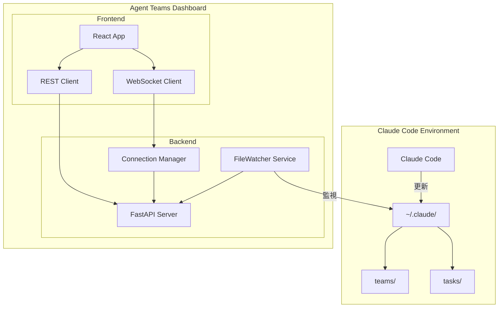
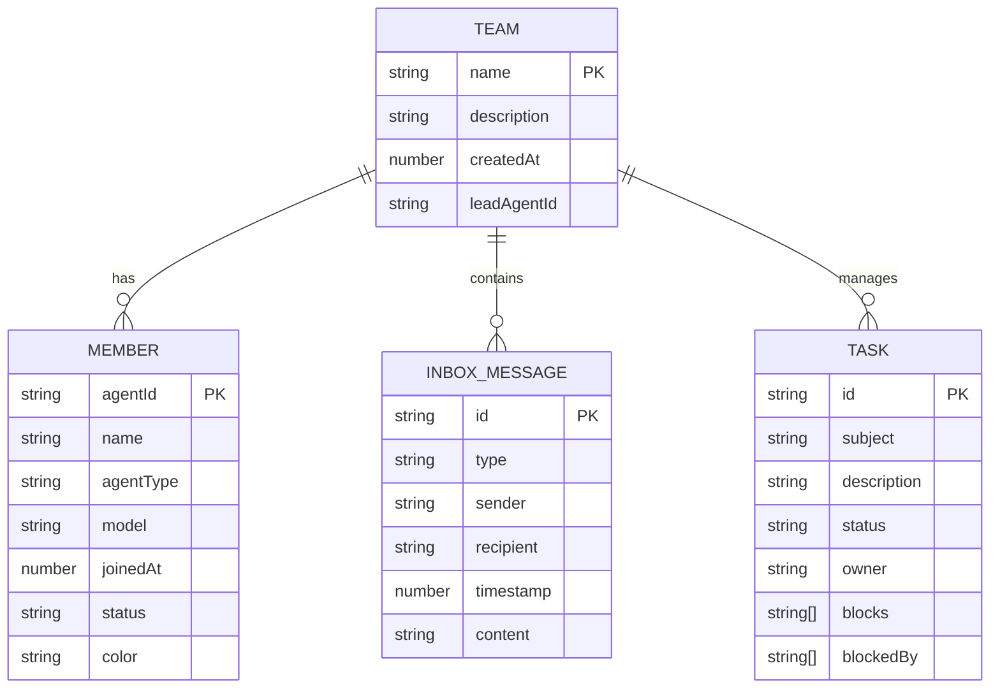

# Agent Teams Dashboard システム設計書

## 1. はじめに

### 1.1 目的

本システム設計書は、Claude CodeのAgent Teams機能をリアルタイムに監視・管理するためのダッシュボードアプリケーション「Agent Teams Dashboard」の設計を定義する。

### 1.2 適用範囲

本設計書は以下の範囲を対象とする。

- バックエンドAPIサーバー（FastAPI）
- フロントエンドWebアプリケーション（React + Vite）
- WebSocketリアルタイム通信
- Claude Codeデータディレクトリ（`~/.claude/`）との連携

### 1.3 用語定義

| 用語 | 定義 |
|------|------|
| Agent Team | Claude Codeで定義されたエージェントのグループ |
| Task | チーム内で管理される作業単位 |
| Inbox | エージェント間のメッセージ受信箱 |
| Activity Event | システム内で発生したイベントの記録 |
| WebSocket | 双方向リアルタイム通信プロトコル |
| FileWatcher | ファイルシステム変更を監視するサービス |

---

## 2. システム概要

### 2.1 システム構成図



### 2.2 コンポーネント一覧

| コンポーネント | 説明 |
|---------------|------|
| FastAPI Server | REST APIとWebSocketを提供するバックエンドサーバー |
| FileWatcher Service | Claudeデータディレクトリの変更を監視 |
| Connection Manager | WebSocket接続を管理 |
| React App | フロントエンドアプリケーション |
| WebSocket Client | リアルタイム通信クライアント |

---

## 3. 機能要件

### 3.1 チーム監視機能

| 機能 | 説明 |
|------|------|
| チーム一覧表示 | 全てのアクティブチームを一覧表示 |
| チーム詳細表示 | 特定チームのメンバー構成、設定を表示 |
| メンバーステータス | 各メンバーの状態（active/idle）を表示 |
| インボックス表示 | チーム内のメッセージ受信箱を表示 |

### 3.2 タスク管理機能

| 機能 | 説明 |
|------|------|
| タスク一覧表示 | 全タスクまたはチーム別タスクを表示 |
| タスク詳細表示 | タスクの説明、状態、依存関係を表示 |
| ステータス表示 | pending/in_progress/completedの状態を視覚化 |
| 依存関係表示 | blocks/blockedByによるタスク間依存を表示 |

### 3.3 リアルタイム更新機能

| 機能 | 説明 |
|------|------|
| WebSocket接続 | バックエンドとの永続的接続を確立 |
| 自動再接続 | 切断時の指数バックオフによる再接続 |
| キープアライブ | 30秒間隔のping/pong通信 |
| ファイル監視 | Claudeデータディレクトリの変更を検知 |

### 3.4 アクティビティフィード機能

| 機能 | 説明 |
|------|------|
| イベント履歴 | システムイベントの時系列表示 |
| リアルタイム追加 | 新規イベントの自動追加 |
| イベント種別 | チーム更新、タスク更新、メッセージ受信 |

---

## 4. 非機能要件

### 4.1 パフォーマンス

| 項目 | 要件 |
|------|------|
| API応答時間 | 500ms以内 |
| WebSocket latency | 100ms以内 |
| ファイル監視デバウンス | 500ms |
| ポーリング間隔 | 10秒 |

### 4.2 可用性

| 項目 | 要件 |
|------|------|
| 自動再接続 | 最大30秒間隔でリトライ |
| ポーリングフォールバック | WebSocket切断時もデータ更新 |

### 4.3 セキュリティ

| 項目 | 要件 |
|------|------|
| CORS | 許可されたオリジンのみ通信可能 |
| 入力検証 | Pydanticによるデータ検証 |

### 4.4 拡張性

| 項目 | 要件 |
|------|------|
| モジュール設計 | 機能単位の分離 |
| 設定管理 | 環境変数による設定変更 |

---

## 5. 外部インターフェース

### 5.1 REST API一覧

#### チーム関連

| エンドポイント | メソッド | 説明 | レスポンス |
|----------------|----------|------|-----------|
| `/api/health` | GET | ヘルスチェック | `{"status": "ok"}` |
| `/api/teams` | GET | 全チーム一覧取得 | `TeamSummary[]` |
| `/api/teams/{team_name}` | GET | 特定チーム詳細取得 | `Team` |
| `/api/teams/{team_name}/inboxes` | GET | チームインボックス取得 | `InboxMessage[]` |

#### タスク関連

| エンドポイント | メソッド | 説明 | レスポンス |
|----------------|----------|------|-----------|
| `/api/tasks` | GET | 全タスク一覧取得 | `TaskSummary[]` |
| `/api/tasks/team/{team_name}` | GET | チーム別タスク取得 | `TaskSummary[]` |
| `/api/tasks/{task_id}` | GET | 特定タスク詳細取得 | `Task` |

### 5.2 WebSocket通信仕様

#### 接続エンドポイント

```
ws://127.0.0.1:8000/ws/{channel}
```

#### チャンネル一覧

| チャンネル | 用途 |
|-----------|------|
| `dashboard` | チーム更新、インボックス更新 |
| `tasks` | タスク状態変更 |

#### メッセージ形式

```typescript
interface WebSocketMessage {
  type: 'team_update' | 'inbox_update' | 'task_update' | 'ping' | 'pong';
  timestamp: number;
  data: unknown;
}
```

#### メッセージタイプ詳細

| タイプ | データ構造 |
|--------|-----------|
| `team_update` | `{ teamName: string }` |
| `inbox_update` | `{ teamName: string, agentName: string }` |
| `task_update` | `{ teamName: string, taskId: string }` |
| `ping` | `{ timestamp: number }` |
| `pong` | `{ timestamp: number }` |

### 5.3 データフォーマット

#### Team

```typescript
interface Team {
  name: string;
  description: string;
  createdAt: number;
  leadAgentId: string;
  members: Member[];
}

interface Member {
  agentId: string;
  name: string;
  agentType: string;
  model: string;
  joinedAt: number;
  status: 'active' | 'idle';
  color: string;
}
```

#### Task

```typescript
interface Task {
  id: string;
  subject: string;
  description: string;
  activeForm: string;
  status: 'pending' | 'in_progress' | 'completed' | 'deleted';
  owner: string;
  blocks: string[];
  blockedBy: string[];
  metadata: Record<string, unknown>;
}
```

#### ActivityEvent

```typescript
interface ActivityEvent {
  id: string;
  type: 'team_update' | 'task_update' | 'message_received';
  timestamp: number;
  message: string;
  data?: Record<string, unknown>;
}
```

---

## 6. データ設計

### 6.1 データモデル図



### 6.2 ファイル構造

#### Claudeデータディレクトリ

```
~/.claude/
├── teams/
│   └── {team_name}/
│       ├── config.json          # チーム設定
│       └── inboxes/
│           └── {agent_name}.json # エージェント別インボックス
└── tasks/
    └── {team_name}/
        └── {task_id}.json       # タスク定義
```

---

## 7. エラー処理

### 7.1 エラーコード一覧

| コード | 説明 |
|--------|------|
| 404 | リソース未検出（チーム、タスクが存在しない） |
| 500 | サーバー内部エラー |
| WS_DISCONNECT | WebSocket切断エラー |
| WS_RECONNECT | WebSocket再接続中 |

### 7.2 例外処理方針

| レイヤー | 方針 |
|----------|------|
| API | 適切なHTTPステータスコードとエラーメッセージを返却 |
| WebSocket | 切断時は自動再接続を試行 |
| フロントエンド | エラー状態をUIに表示、ポーリングで復旧を試行 |

---

## 8. 技術スタック

### 8.1 バックエンド

| カテゴリ | 技術 | バージョン |
|----------|------|-----------|
| 言語 | Python | 3.11+ |
| フレームワーク | FastAPI | 0.109.0+ |
| ASGIサーバー | Uvicorn | 0.27.0+ |
| データ検証 | Pydantic | 2.5.0+ |
| ファイル監視 | watchdog | 4.0.0+ |
| WebSocket | websockets | 12.0+ |

### 8.2 フロントエンド

| カテゴリ | 技術 | バージョン |
|----------|------|-----------|
| 言語 | TypeScript | 5.3.0+ |
| フレームワーク | React | 18.2.0 |
| バンドラー | Vite | 5.0.0+ |
| CSS | Tailwind CSS | 3.4.0+ |
| E2Eテスト | Puppeteer | 24.37.3+ |

---

## 9. 設定管理

### 9.1 バックエンド設定

環境変数プレフィックス: `DASHBOARD_`

| 変数名 | デフォルト値 | 説明 |
|--------|-------------|------|
| `DASHBOARD_HOST` | `127.0.0.1` | サーバー待ち受けアドレス |
| `DASHBOARD_PORT` | `8000` | サーバー待ち受けポート |
| `DASHBOARD_DEBUG` | `True` | デバッグモード |
| `DASHBOARD_CLAUDE_DIR` | `~/.claude` | Claudeデータディレクトリ |

### 9.2 フロントエンド設定

| 設定項目 | 値 |
|----------|-----|
| 開発サーバーポート | `5173` |
| APIプロキシ | `/api` → `http://127.0.0.1:8000` |
| WebSocketプロキシ | `/ws` → `ws://127.0.0.1:8000` |

---

## 10. 今後の拡張ポイント

| 項目 | 説明 |
|------|------|
| 認証・認可 | ユーザー認証機能の追加 |
| データベース | 永続化ストレージの追加 |
| E2Eテスト | 自動テストの実装 |
| ログ管理 | 構造化ログの導入 |
| パフォーマンス監視 | メトリクス収集機能 |
| i18n | 多言語対応 |

---

*作成日: 2026-02-16*
*バージョン: 1.0.0*
