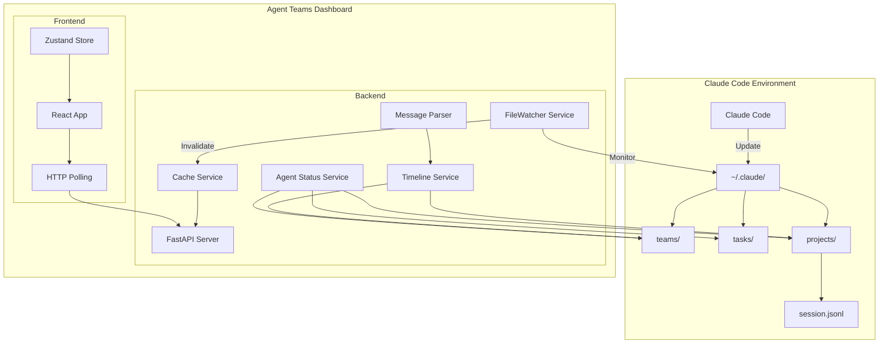
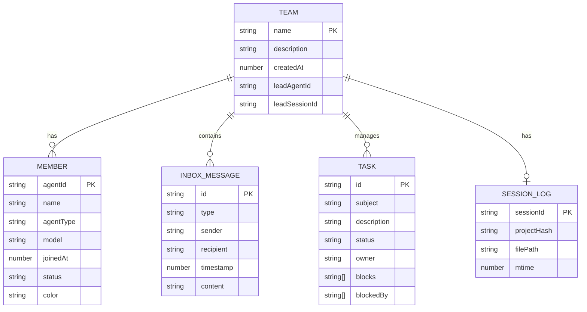

# Agent Teams Dashboard System Design Document

---

**Language:** [English](./system-design.en.md) | [日本語](./system-design.md) | [中文](./system-design.zh.md)

---

## 1. Introduction

### 1.1 Purpose

This system design document defines the design of the "Agent Teams Dashboard" application for real-time monitoring and management of Claude Code's Agent Teams functionality.

### 1.2 Scope

This design document covers the following areas:

- Backend API server (FastAPI)
- Frontend web application (React + Vite)
- Real-time updates via HTTP polling
- Integration with Claude Code data directory (`~/.claude/`)
- Session log integrated timeline functionality
- Team deletion functionality

### 1.3 Terminology

| Term | Definition |
|------|------------|
| Agent Team | A group of agents defined in Claude Code |
| Task | A unit of work managed within a team |
| Inbox | Message inbox between agents |
| Session Log | Claude Code session history (`.jsonl` file) |
| Timeline | Time-series view integrating inbox + session logs |
| Protocol Message | Standardized messages for agent communication (task_assignment, idle_notification, etc.) |
| HTTP Polling | Data update method via periodic HTTP requests |
| FileWatcher | Service that monitors filesystem changes and invalidates cache |
| CacheService | High-speed service using in-memory cache |

---

## 2. Design Philosophy

### 2.1 Why HTTP Polling Was Adopted

**Background and Challenges:**
Claude Code directly updates files under `~/.claude/`, making external push notifications impossible. While WebSocket connections are possible, HTTP polling is adopted as the primary means for real-time updates.

**Selected Approach:**
- Frontend performs HTTP polling at 5-60 second intervals (default: 30 seconds)
- FileWatcher detects file changes and **invalidates cache** (not real-time push)
- Cache reduces file access during polling

**Trade-offs:**
- Real-time capability has delays of several seconds to tens of seconds
- Server load increases, but cache reduces actual I/O

### 2.2 Why Determine Status Based on Session Log mtime

**Background and Challenges:**
To determine a team's "active status," the mtime of `config.json` was used, but it could be updated at times unrelated to team activity.

**Selected Approach:**
Use the mtime of session log (`{sessionId}.jsonl`):
- Session logs record actual agent activity (thinking, tool execution, file changes)
- Therefore, session log update time = team's last activity time

**Determination Logic:**
```
1. members is empty → 'inactive'
2. No session log → 'unknown'
3. Session log mtime > 1 hour → 'stopped'
4. Otherwise → 'active'
```

### 2.3 Why an Integrated Timeline Service Was Introduced

**Background and Challenges:**
Messages between agents (inbox) and session logs (activity history) are stored in separate locations, with no unified view.

**Selected Approach:**
`TimelineService` integrates both:
- **inbox**: Task assignments, completion notifications, idle notifications between agents
- **Session logs**: Thinking processes, tool execution, file changes
- Returns sorted in chronological order in integrated timeline

---

## 3. System Overview

### 3.1 System Architecture Diagram



### 3.2 Component List

| Component | Description |
|-----------|-------------|
| FastAPI Server | Backend server providing REST API |
| FileWatcher Service | Monitors Claude data directory changes, invalidates cache |
| CacheService | Reduces file access with in-memory cache (with TTL) |
| TimelineService | Integration service for inbox + session logs |
| AgentStatusService | Agent status inference service |
| MessageParser | Protocol message parsing service |
| React App | Frontend application |
| Zustand Store | Global state management, polling control |
| HTTP Polling | Periodic data update client |

### 3.3 Function and Data Source Mapping

| Function | Target Files | Description |
|----------|--------------|-------------|
| **Team List** | `~/.claude/teams/{team_name}/config.json` | Team settings, member information |
| **Team Status Determination** | `~/.claude/projects/{project-hash}/{sessionId}.jsonl` | Determined by session log mtime |
| **Inboxes** | `~/.claude/teams/{team_name}/inboxes/{agent_name}.json` | Per-agent message inboxes |
| **Tasks** | `~/.claude/tasks/{team_name}/{task_id}.json` | Task definitions and status |
| **Integrated Timeline** | All above + session logs | Inbox + session log integration |
| **Agent Status** | Tasks + Inboxes + Session logs | Determined by status inference logic |

---

## 4. Functional Requirements

### 4.1 Team Monitoring Features

| Feature | Description |
|---------|-------------|
| Team list display | Display all teams with status |
| Team detail display | Display specific team member composition and settings |
| Member status | Display each member's status (active/idle) |
| Inbox display | Display message inbox within team |
| Team status determination | 4-state determination based on session log mtime |
| Team deletion | Delete teams with stopped/inactive/unknown status |

#### Team Status Determination Flow

```
┌─────────────────────────────────────────────────────────┐
│               Team Status Determination                  │
├─────────────────────────────────────────────────────────┤
│                                                         │
│  ┌──────────────────┐                                   │
│  │ members empty?   │                                   │
│  └────────┬─────────┘                                   │
│           │                                             │
│     ┌─────┴─────┐                                       │
│     │ Yes       │ No                                    │
│     ▼           ▼                                       │
│ ┌────────┐  ┌──────────────────────┐                   │
│ │inactive│  │ Session log exists?  │                   │
│ └────────┘  └──────────┬───────────┘                   │
│                        │                                │
│                  ┌─────┴─────┐                          │
│                  │ No        │ Yes                      │
│                  ▼           ▼                          │
│              ┌────────┐  ┌─────────────────────┐        │
│              │unknown │  │ mtime > 1 hour?     │        │
│              └────────┘  └──────────┬──────────┘        │
│                                     │                   │
│                               ┌─────┴─────┐             │
│                               │ Yes       │ No          │
│                               ▼           ▼             │
│                           ┌────────┐  ┌────────┐        │
│                           │stopped │  │ active │        │
│                           └────────┘  └────────┘        │
│                                                         │
└─────────────────────────────────────────────────────────┘
```

#### Team Deletion Feature

**Deletable Statuses**: `stopped`, `inactive`, `unknown`

**Files to Delete**:
1. Entire `teams/{team_name}/` directory (config.json, inboxes/)
2. Entire `tasks/{team_name}/` directory
3. Session file only (`projects/{hash}/{session}.jsonl`)
   - Project directory itself remains (may belong to other teams)

**Non-deletable**: `active` status teams (400 Bad Request)

### 4.2 Task Management Features

| Feature | Description |
|---------|-------------|
| Task list display | Display all tasks or team-specific tasks |
| Task detail display | Display task description, status, dependencies |
| Status display | Visualize pending/in_progress/completed/stopped states |
| Team filter | Filter tasks for specific team only |
| Search function | Search tasks by subject/assignee |
| Task stop determination | Display tasks with no updates for 24+ hours as stopped |

### 4.3 Integrated Timeline Features

| Feature | Description |
|---------|-------------|
| Timeline display | Time-series display integrating inbox + session logs |
| Message type display | Format and display protocol messages by type |
| Session log display | Display thinking, tool execution, file changes |
| Sender→Recipient display | Explicitly show message sender and recipient |
| Markdown support | Format and display Markdown in messages |
| Date separator | Display messages grouped by date |
| Time range filter | Display only messages within specified time range |
| Sender filter | Display only specific agent's messages |
| Differential update | Fetch only changes since last time using since parameter |

#### Session Log Entry Types

| Type | Content | Display Icon |
|------|---------|--------------|
| `user_message` | User input | 👤 |
| `assistant_message` | Assistant response | 🤖 |
| `thinking` | Thinking process | 💭 |
| `tool_use` | Tool invocation | 🔧 |
| `file_change` | File change | 📁 |

### 4.4 Agent Status Inference Features

| Status | Determination Condition | Display |
|--------|------------------------|---------|
| `idle` | No activity for 5+ minutes | 💤 Idle |
| `working` | Has in_progress task | 🔵 Working |
| `waiting` | Has blocked task | ⏳ Waiting |
| `error` | No activity for 30+ minutes | ❌ Error |
| `completed` | All tasks completed | ✅ Completed |

**Data Used for Status Inference**:
- Inbox messages (task_assignment, task_completed, etc.)
- Task definitions (owner, status, blockedBy)
- Session logs (last activity time, model used)

### 4.5 Real-time Update Features

| Feature | Description |
|---------|-------------|
| HTTP Polling | Periodic data updates at 5-60 second intervals |
| Polling interval setting | User configurable (5s/10s/20s/30s/60s) |
| Differential update | Reduce data transfer with since parameter |
| File monitoring | Detect changes in Claude data directory |
| Cache invalidation | Auto-update cache via FileWatcher integration |

---

## 5. Non-functional Requirements

### 5.1 Performance

| Item | Requirement |
|------|-------------|
| API response time | Within 500ms |
| File monitoring debounce | 500ms |
| Polling interval | Default 30 seconds (configurable: 5-60 seconds) |
| Cache TTL | Config 30 seconds, inbox 60 seconds |

### 5.2 Availability

| Item | Requirement |
|------|-------------|
| Auto-recovery | Recover on next polling after error |
| Cache resilience | Use cached data on file access failure |

### 5.3 Security

| Item | Requirement |
|------|-------------|
| CORS | Communication allowed only from permitted origins |
| Input validation | Data validation via Pydantic |
| Deletion protection | Prohibit deletion of active teams |

### 5.4 Extensibility

| Item | Requirement |
|------|-------------|
| Module design | Separation by function |
| Configuration management | Setting changes via environment variables |
| Service extension | Easy addition of new data sources to TimelineService |

---

## 6. External Interfaces

### 6.1 REST API List

> **Legend**: ✅ = Used in frontend, ❌ = Unused in frontend (backend only implemented), ⚠️ = For monitoring/debugging

#### Health and System Related

| Endpoint | Method | Description | Response | Used |
|----------|--------|-------------|----------|------|
| `/api/health` | GET | Health check | `{"status": "ok"}` | ⚠️ Monitoring |
| `/api/models` | GET | Get available model list | `ModelListResponse` | ❌ Unused |
| `/api/cache/stats` | GET | Get cache statistics | `object` | ❌ Unused |

#### Team Related

| Endpoint | Method | Description | Response | Used |
|----------|--------|-------------|----------|------|
| `/api/teams/` | GET | Get all teams list (with status) | `TeamSummary[]` | ✅ Used |
| `/api/teams/{team_name}` | GET | Get specific team details | `Team` | ✅ Used |
| `/api/teams/{team_name}` | DELETE | Delete team (stopped/inactive/unknown only) | `DeleteResult` | ✅ Used |
| `/api/teams/{team_name}/inboxes` | GET | Get team inboxes | `object` | ✅ Used |
| `/api/teams/{team_name}/inboxes/{agent_name}` | GET | Get agent-specific inbox | `object` | ✅ Used |

#### Task Related

| Endpoint | Method | Description | Response | Used |
|----------|--------|-------------|----------|------|
| `/api/tasks/` | GET | Get all tasks list | `TaskSummary[]` | ✅ Used |
| `/api/tasks/team/{team_name}` | GET | Get team-specific tasks (detailed) | `Task[]` | ✅ Used |
| `/api/tasks/{task_id}` | GET | Get specific task details (team_name is query param) | `Task` | ❌ Unused |

#### Agent Related

| Endpoint | Method | Description | Response | Used |
|----------|--------|-------------|----------|------|
| `/api/teams/{team_name}/agents/status` | GET | Get agent statuses within team | `AgentStatusList` | ❌ Unused |
| `/api/teams/{team_name}/agents/typing` | GET | Get typing agents list | `TypingIndicators` | ❌ Unused |

#### Message Related

| Endpoint | Method | Description | Response | Used |
|----------|--------|-------------|----------|------|
| `/api/teams/{team_name}/messages/timeline` | GET | Get messages for timeline display | `TimelineData` | ✅ Used |
| `/api/teams/{team_name}/messages` | GET | Get message list (raw data) | `object` | ❌ Unused |
| `/api/teams/{team_name}/messages/chat` | GET | Get chat format messages | `ChatMessageList` | ❌ Unused |

#### Integrated Timeline Related

| Endpoint | Method | Description | Response | Used |
|----------|--------|-------------|----------|------|
| `/api/timeline/{team_name}/history` | GET | Get integrated timeline history | `UnifiedTimelineResponse` | ✅ Used |
| `/api/timeline/{team_name}/updates` | GET | Get differential updates (uses since parameter) | `UnifiedTimelineResponse` | ✅ Used |

> **Note**: APIs unused in frontend (❌) are implemented for future feature expansion or external tool integration.

### 6.2 Query Parameters

#### `/api/timeline/{team_name}/history`

| Parameter | Type | Required | Description |
|-----------|------|----------|-------------|
| `limit` | int | No | Max fetch count (1-10000, default 100) |
| `types` | string | No | Type filter (comma-separated, e.g.: message,thinking,tool_use) |
| `before_event_id` | string | No | For pagination (get entries older than this event ID) |

#### `/api/timeline/{team_name}/updates`

| Parameter | Type | Required | Description |
|-----------|------|----------|-------------|
| `since` | string | No | Reference time (ISO8601 format, get only entries after this time) |
| `limit` | int | No | Max fetch count (1-200, default 50) |

#### `/api/teams/{team_name}/messages/timeline`

| Parameter | Type | Required | Description |
|-----------|------|----------|-------------|
| `start_time` | string | No | Start time (ISO 8601 format) |
| `end_time` | string | No | End time (ISO 8601 format) |
| `since` | string | No | Reference time for differential update (ISO 8601 format) |
| `senders` | string | No | Sender filter (comma-separated) |
| `types` | string | No | Type filter (comma-separated) |
| `search` | string | No | Full-text search query |
| `unread_only` | boolean | No | Get only unread (default: false) |
| `limit` | int | No | Max fetch count (max 500, default 100) |
| `offset` | int | No | Offset (default 0) |

#### `/api/teams/{team_name}/messages/chat`

| Parameter | Type | Required | Description |
|-----------|------|----------|-------------|
| `start_time` | string | No | Start time (ISO 8601 format) |
| `end_time` | string | No | End time (ISO 8601 format) |
| `since` | string | No | Reference time for differential update (ISO 8601 format) |
| `senders` | string | No | Sender filter (comma-separated) |
| `types` | string | No | Type filter (comma-separated) |
| `search` | string | No | Full-text search query |
| `unread_only` | boolean | No | Get only unread (default: false) |
| `limit` | int | No | Max fetch count (max 500, default 100) |
| `offset` | int | No | Offset (default 0) |

### 6.3 Data Formats

#### Team

```typescript
interface Team {
  name: string;
  description: string;
  createdAt: number;
  leadAgentId: string;
  leadSessionId: string;
  members: Member[];
}

interface TeamSummary {
  name: string;
  description: string;
  memberCount: number;
  taskCount: number;
  status: 'active' | 'inactive' | 'stopped' | 'unknown';
  leadAgentId: string;
  createdAt?: number;
}

interface Member {
  agentId: string;
  name: string;
  agentType: string;
  model: string;
  joinedAt: number;
  status: 'active' | 'idle';
  color?: string;
}
```

#### Task

```typescript
interface Task {
  id: string;
  subject: string;
  description: string;
  activeForm: string;
  status: 'pending' | 'in_progress' | 'completed' | 'deleted' | 'stopped';
  owner: string;
  team: string;
  blocks: string[];
  blockedBy: string[];
  metadata: Record<string, unknown>;
}

interface TaskSummary {
  id: string;
  subject: string;
  status: 'pending' | 'in_progress' | 'completed' | 'deleted' | 'stopped';
  owner: string;
  team: string;
}
```

#### UnifiedTimelineEntry

```typescript
interface UnifiedTimelineEntry {
  id: string;
  content: string;
  from_: string;  // from_ used because 'from' is reserved in Python
  to?: string;
  timestamp: string;
  color?: string;
  read: boolean;
  summary?: string;
  source: 'inbox' | 'session';
  parsed_type: string;
  parsed_data?: Record<string, unknown>;
  details?: Record<string, unknown>;
}

type TimelineMessageType =
  | 'message'
  | 'idle_notification'
  | 'shutdown_request'
  | 'shutdown_response'
  | 'shutdown_approved'
  | 'plan_approval_request'
  | 'plan_approval_response'
  | 'task_assignment'
  | 'task_completed'
  | 'unknown';

type SessionLogType =
  | 'user_message'
  | 'assistant_message'
  | 'thinking';
  // Note: tool_use and file-history-snapshot are excluded from timeline
```

#### DeleteResult

```typescript
interface DeleteResult {
  message: string;
  deletedPaths: string[];
}
```

#### ChatMessage

```typescript
interface ChatMessage {
  id: string;
  from: string;
  to?: string;
  text: string;
  summary?: string;
  timestamp: string;
  type: string;  // default: 'message'
  isPrivate: boolean;  // default: false
  visibleTo: string[];  // default: []
  read: boolean;  // default: false
  color?: string;
}

interface ChatMessageList {
  messages: ChatMessage[];
  count: number;  // default: 0
  hasMore: boolean;  // default: false
}
```

#### AgentStatus

```typescript
interface AgentStatus {
  name: string;
  status: 'online' | 'idle' | 'offline';
  lastActivity?: string;  // ISO 8601 format
}

interface AgentStatusList {
  agents: AgentStatus[];  // default: []
}
```

#### TypingIndicators

```typescript
interface TypingIndicators {
  typing: string[];  // default: []
}
```

#### TimelineData (for vis-timeline)

```typescript
interface TimelineData {
  items: TimelineItem[];
  groups: TimelineGroup[];
  timeRange: { [key: string]: string };
  count: number;  // default: 0
  total: number;  // default: 0
  hasMore: boolean;  // default: false
}

interface TimelineItem {
  id: string;
  content: string;
  start: string;
  type: 'box' | 'point';  // default: 'box'
  className: string;  // default: 'timeline-item'
  group: string;
  receiver?: string;
  data: Record<string, unknown>;
}

interface TimelineGroup {
  id: string;
  content: string;
  className?: string;  // default: 'timeline-group'
}
```

#### ModelConfig

```typescript
interface ModelConfig {
  id: string;
  color: string;
  icon: string;
  label: string;
  provider: 'anthropic' | 'moonshot' | 'zhipu' | 'other';
}

interface ModelListResponse {
  models: ModelConfig[];
}
```

---

## 7. Data Design

### 7.1 Data Model Diagram



### 7.2 File Structure

#### Claude Data Directory

```
~/.claude/
├── teams/
│   └── {team_name}/
│       ├── config.json          # Team settings
│       │                        # - name, description, members
│       │                        # - leadAgentId, leadSessionId
│       └── inboxes/
│           └── {agent_name}.json # Per-agent inbox
├── tasks/
│   └── {team_name}/
│       └── {task_id}.json       # Task definition
└── projects/
    └── {project-hash}/          # project-hash = "-" + cwd.replace("/", "-")
        └── {sessionId}.jsonl    # Session history
```

#### project-hash Conversion Logic

```python
def _cwd_to_project_hash(cwd: str) -> str:
    return "-" + cwd.lstrip("/").replace("/", "-")
```

Examples:
- `/Users/user/project` → `-Users-user-project`
- `/home/user/workspace` → `-home-user-workspace`

---

## 8. Error Handling

### 8.1 Error Code List

| Code | Description |
|------|-------------|
| 400 Bad Request | Non-deletable team (active status) |
| 404 Not Found | Resource not found (team, task, or inbox does not exist) |
| 500 Internal Server Error | Server internal error |

### 8.2 Exception Handling Policy

| Layer | Policy |
|-------|--------|
| API | Return appropriate HTTP status code and Japanese error message |
| File loading | Log read errors and skip |
| Frontend | Display error state in UI, attempt recovery on next polling |

---

## 9. Technology Stack

### 9.1 Backend

| Category | Technology | Version |
|----------|------------|---------|
| Language | Python | 3.11+ |
| Framework | FastAPI | 0.109.0+ |
| ASGI Server | Uvicorn | 0.27.0+ |
| Data Validation | Pydantic | 2.5.0+ |
| File Monitoring | watchdog | 4.0.0+ |

### 9.2 Frontend

| Category | Technology | Version |
|----------|------------|---------|
| Language | TypeScript | 5.3.0+ |
| Framework | React | 18.2.0 |
| Bundler | Vite | 5.0.0+ |
| CSS | Tailwind CSS | 3.4.0+ |
| State Management | Zustand | 5.0.2+ |
| Data Fetching | TanStack Query | 5.90.21+ |
| Virtual Scroll | @tanstack/react-virtual | 3.10.8+ |
| Markdown | react-markdown | 10.1.0+ |
| Date Handling | date-fns | 4.1.0+ |
| Graph Visualization | D3.js | 7.8.5+ |
| Timeline | vis-timeline | 7.7.3+ |
| UI Components | Radix UI | 1.x |
| Icons | lucide-react | 0.344.0+ |

---

## 10. Configuration Management

### 10.1 Backend Configuration

Environment variable prefix: `DASHBOARD_`

| Variable Name | Default Value | Description |
|---------------|---------------|-------------|
| `DASHBOARD_HOST` | `127.0.0.1` | Server listen address |
| `DASHBOARD_PORT` | `8000` | Server listen port |
| `DASHBOARD_DEBUG` | `True` | Debug mode |
| `DASHBOARD_CLAUDE_DIR` | `~/.claude` | Claude data directory |

### 10.2 Frontend Configuration

| Setting | Value |
|---------|-------|
| Dev server port | `5173` |
| API proxy | `/api` → `http://127.0.0.1:8000` |
| Polling interval (default) | `30 seconds` |
| Polling interval (options) | `5s, 10s, 20s, 30s, 60s` |

---

## 11. Future Extension Points

| Item | Description |
|------|-------------|
| Authentication/Authorization | Add user authentication |
| Database | Add persistent storage |
| E2E Testing | Implement automated testing |
| Log Management | Introduce structured logging |
| Performance Monitoring | Metrics collection feature |
| i18n | Multi-language support |
| New Data Sources | Integrate external logs into TimelineService |

---

*Created: 2026-02-16*
*Last Updated: 2026-02-24*
*Version: 2.1.0*
