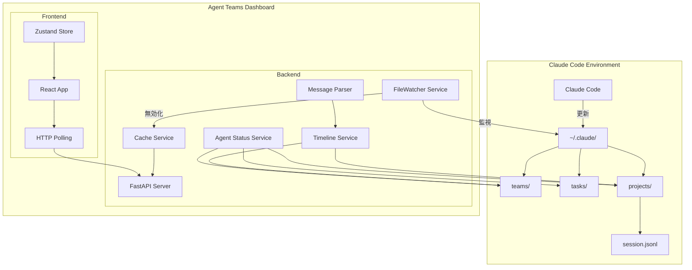
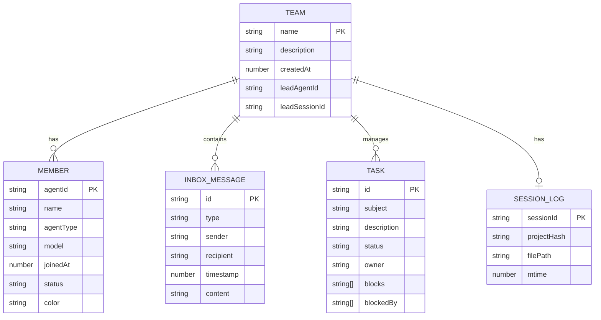

# Agent Teams Dashboard システム設計書

## 1. はじめに

### 1.1 目的

本システム設計書は、Claude CodeのAgent Teams機能をリアルタイムに監視・管理するためのダッシュボードアプリケーション「Agent Teams Dashboard」の設計を定義する。

### 1.2 適用範囲

本設計書は以下の範囲を対象とする。

- バックエンドAPIサーバー（FastAPI）
- フロントエンドWebアプリケーション（React + Vite）
- HTTP ポーリングによるリアルタイム更新
- Claude Codeデータディレクトリ（`~/.claude/`）との連携
- セッションログ統合タイムライン機能
- チーム削除機能

### 1.3 用語定義

| 用語 | 定義 |
|------|------|
| Agent Team | Claude Codeで定義されたエージェントのグループ |
| Task | チーム内で管理される作業単位 |
| Inbox | エージェント間のメッセージ受信箱 |
| Session Log | Claude Codeのセッション履歴（`.jsonl`ファイル） |
| Timeline | inbox + セッションログを統合した時系列ビュー |
| Protocol Message | エージェント間通信の定型メッセージ（task_assignment, idle_notification等） |
| HTTP Polling | 定期的なHTTPリクエストによるデータ更新方式 |
| FileWatcher | ファイルシステム変更を監視し、キャッシュを無効化するサービス |
| CacheService | メモリキャッシュによる高速化サービス |

---

## 2. 設計思想

### 2.1 なぜHTTPポーリングを採用したか

**背景と課題:**
Claude Code が `~/.claude/` 配下のファイルを直接更新するため、外部からの Push 通知ができない。WebSocket も接続できるが、リアルタイム更新の主手段としては HTTP ポーリングを採用している。

**選択したアプローチ:**
- フロントエンドは 5秒〜60秒（デフォルト30秒）の間隔で HTTP ポーリング
- FileWatcher はファイル変更を検知し、**キャッシュを無効化**（リアルタイムPushではない）
- キャッシュにより、ポーリング時のファイルアクセスを削減

**トレードオフ:**
- リアルタイム性は数秒〜数十秒の遅延が発生
- サーバー負荷は増加するが、キャッシュで実質的な I/O を削減

### 2.2 なぜセッションログのmtimeでステータス判定するか

**背景と課題:**
チームの「アクティブ状態」を判定するために、`config.json` の mtime を使用していたが、チーム活動と関係ないタイミングで更新される場合があった。

**選択したアプローチ:**
セッションログ（`{sessionId}.jsonl`）の mtime を使用：
- セッションログはエージェントの実際の活動（思考、ツール実行、ファイル変更）を記録
- したがって、セッションログの更新時刻 = チームの最終活動時刻

**判定ロジック:**
```
1. members が空 → 'inactive'
2. セッションログなし → 'unknown'
3. セッションログ mtime > 1時間 → 'stopped'
4. それ以外 → 'active'
```

### 2.3 なぜ統合タイムラインサービスを導入したか

**背景と課題:**
エージェント間のメッセージ（inbox）とセッションログ（活動履歴）が別々の場所に保存されており、統一されたビューがなかった。

**選択したアプローチ:**
`TimelineService` で両者を統合：
- **inbox**: エージェント間のタスク割り当て、完了通知、アイドル通知
- **セッションログ**: 思考プロセス、ツール実行、ファイル変更
- 統合タイムラインで時系列順にソートして返却

---

## 3. システム概要

### 3.1 システム構成図



### 3.2 コンポーネント一覧

| コンポーネント | 説明 |
|---------------|------|
| FastAPI Server | REST APIを提供するバックエンドサーバー |
| FileWatcher Service | Claudeデータディレクトリの変更を監視、キャッシュ無効化 |
| CacheService | メモリキャッシュ（TTL付き）によるファイルアクセス削減 |
| TimelineService | inbox + セッションログの統合サービス |
| AgentStatusService | エージェント状態の推論サービス |
| MessageParser | プロトコルメッセージの解析サービス |
| React App | フロントエンドアプリケーション |
| Zustand Store | グローバル状態管理、ポーリング制御 |
| HTTP Polling | 定期的なデータ更新クライアント |

### 3.3 各機能とデータソース対応表

| 機能 | 読み込み対象ファイル | 説明 |
|------|---------------------|------|
| **チーム一覧** | `~/.claude/teams/{team_name}/config.json` | チーム設定、メンバー情報 |
| **チームステータス判定** | `~/.claude/projects/{project-hash}/{sessionId}.jsonl` | セッションログの mtime で判定 |
| **インボックス** | `~/.claude/teams/{team_name}/inboxes/{agent_name}.json` | エージェント別メッセージ受信箱 |
| **タスク** | `~/.claude/tasks/{team_name}/{task_id}.json` | タスク定義・ステータス |
| **統合タイムライン** | 上記すべて + セッションログ | inbox + セッションログ統合 |
| **エージェント状態** | タスク + インボックス + セッションログ | 状態推論ロジックで判定 |

---

## 4. 機能要件

### 4.1 チーム監視機能

| 機能 | 説明 |
|------|------|
| チーム一覧表示 | 全てのチームを一覧表示（ステータス付き） |
| チーム詳細表示 | 特定チームのメンバー構成、設定を表示 |
| メンバーステータス | 各メンバーの状態（active/idle）を表示 |
| インボックス表示 | チーム内のメッセージ受信箱を表示 |
| チームステータス判定 | セッションログ mtime に基づく4状態判定 |
| チーム削除 | stopped/inactive/unknown 状態のチームを削除 |

#### チームステータス判定フロー

```
┌─────────────────────────────────────────────────────────┐
│               チームステータス判定                        │
├─────────────────────────────────────────────────────────┤
│                                                         │
│  ┌──────────────────┐                                   │
│  │ members が空？   │                                   │
│  └────────┬─────────┘                                   │
│           │                                             │
│     ┌─────┴─────┐                                       │
│     │ Yes       │ No                                    │
│     ▼           ▼                                       │
│ ┌────────┐  ┌──────────────────────┐                   │
│ │inactive│  │ セッションログ存在？  │                   │
│ └────────┘  └──────────┬───────────┘                   │
│                        │                                │
│                  ┌─────┴─────┐                          │
│                  │ No        │ Yes                      │
│                  ▼           ▼                          │
│              ┌────────┐  ┌─────────────────────┐        │
│              │unknown │  │ mtime > 1時間？     │        │
│              └────────┘  └──────────┬──────────┘        │
│                                     │                   │
│                               ┌─────┴─────┐             │
│                               │ Yes       │ No          │
│                               ▼           ▼             │
│                           ┌────────┐  ┌────────┐        │
│                           │stopped │  │ active │        │
│                           └────────┘  └────────┘        │
│                                                         │
└─────────────────────────────────────────────────────────┘
```

#### チーム削除機能

**削除可能なステータス**: `stopped`, `inactive`, `unknown`

**削除対象ファイル**:
1. `teams/{team_name}/` ディレクトリ全体（config.json, inboxes/）
2. `tasks/{team_name}/` ディレクトリ全体
3. セッションファイルのみ（`projects/{hash}/{session}.jsonl`）
   - プロジェクトディレクトリ自体は残す（他チームの可能性があるため）

**削除不可**: `active` 状態のチーム（400 Bad Request）

### 4.2 タスク管理機能

| 機能 | 説明 |
|------|------|
| タスク一覧表示 | 全タスクまたはチーム別タスクを表示 |
| タスク詳細表示 | タスクの説明、状態、依存関係を表示 |
| ステータス表示 | pending/in_progress/completed/stoppedの状態を視覚化 |
| チームフィルタ | 特定チームのタスクのみをフィルタリング |
| 検索機能 | 件名・担当者でタスクを検索 |
| タスク停止判定 | 24時間以上更新がないタスクを停止状態として表示 |

### 4.3 統合タイムライン機能

| 機能 | 説明 |
|------|------|
| タイムライン表示 | inbox + セッションログを統合した時系列表示 |
| メッセージタイプ別表示 | プロトコルメッセージをタイプ別に整形して表示 |
| セッションログ表示 | 思考、ツール実行、ファイル変更を表示 |
| 送信者→受信者表示 | メッセージの送信者と受信者を明示的に表示 |
| Markdown対応 | メッセージ内のMarkdownを整形して表示 |
| 日付セパレーター | 日付ごとにメッセージを区切って表示 |
| 時間範囲フィルタ | 指定時間範囲のメッセージのみ表示 |
| 送信者フィルタ | 特定エージェントのメッセージのみ表示 |
| 差分更新 | since パラメータで前回以降の変更のみ取得 |

#### セッションログエントリタイプ

| タイプ | 内容 | 表示アイコン |
|--------|------|-------------|
| `user_message` | ユーザー入力 | 👤 |
| `assistant_message` | アシスタント応答 | 🤖 |
| `thinking` | 思考プロセス | 💭 |
| `tool_use` | ツール呼び出し | 🔧 |
| `file_change` | ファイル変更 | 📁 |

### 4.4 エージェント状態推論機能

| 状態 | 判定条件 | 表示 |
|------|---------|------|
| `idle` | 5分以上無活動 | 💤 待機中 |
| `working` | in_progress タスクあり | 🔵 作業中 |
| `waiting` | blocked なタスクあり | ⏳ 待ち状態 |
| `error` | 30分以上無活動 | ❌ エラー |
| `completed` | 全タスク完了 | ✅ 完了 |

**状態推論に使用するデータ**:
- inbox メッセージ（task_assignment, task_completed 等）
- タスク定義（owner, status, blockedBy）
- セッションログ（最終活動時刻、使用モデル）

### 4.5 リアルタイム更新機能

| 機能 | 説明 |
|------|------|
| HTTP ポーリング | 5秒〜60秒間隔で定期的にデータ更新 |
| ポーリング間隔設定 | ユーザーが設定可能（5s/10s/20s/30s/60s） |
| 差分更新 | since パラメータでデータ転送量を削減 |
| ファイル監視 | Claudeデータディレクトリの変更を検知 |
| キャッシュ無効化 | FileWatcher 連携でキャッシュを自動更新 |

---

## 5. 非機能要件

### 5.1 パフォーマンス

| 項目 | 要件 |
|------|------|
| API応答時間 | 500ms以内 |
| ファイル監視デバウンス | 500ms |
| ポーリング間隔 | デフォルト30秒（設定可能: 5秒〜60秒） |
| キャッシュTTL | 設定30秒、インボックス60秒 |

### 5.2 可用性

| 項目 | 要件 |
|------|------|
| 自動復旧 | エラー時も次回ポーリングで復旧 |
| キャッシュによる耐障害性 | ファイルアクセス失敗時はキャッシュデータを使用 |

### 5.3 セキュリティ

| 項目 | 要件 |
|------|------|
| CORS | 許可されたオリジンのみ通信可能 |
| 入力検証 | Pydanticによるデータ検証 |
| 削除保護 | active チームの削除禁止 |

### 5.4 拡張性

| 項目 | 要件 |
|------|------|
| モジュール設計 | 機能単位の分離 |
| 設定管理 | 環境変数による設定変更 |
| サービス拡張 | TimelineService への新規データソース追加が容易 |

---

## 6. 外部インターフェース

### 6.1 REST API一覧

#### チーム関連

| エンドポイント | メソッド | 説明 | レスポンス |
|----------------|----------|------|-----------|
| `/api/health` | GET | ヘルスチェック | `{"status": "ok"}` |
| `/api/teams` | GET | 全チーム一覧取得（ステータス付き） | `TeamSummary[]` |
| `/api/teams/{team_name}` | GET | 特定チーム詳細取得 | `Team` |
| `/api/teams/{team_name}` | DELETE | チーム削除（stopped/inactive/unknownのみ） | `DeleteResult` |
| `/api/teams/{team_name}/inboxes` | GET | チームインボックス取得 | `InboxMessage[]` |
| `/api/teams/{team_name}/inboxes/{agent}` | GET | エージェント別インボックス取得 | `InboxMessage[]` |

#### タスク関連

| エンドポイント | メソッド | 説明 | レスポンス |
|----------------|----------|------|-----------|
| `/api/tasks` | GET | 全タスク一覧取得 | `TaskSummary[]` |
| `/api/tasks/team/{team_name}` | GET | チーム別タスク取得 | `TaskSummary[]` |
| `/api/tasks/{team}/{task_id}` | GET | 特定タスク詳細取得 | `Task` |

#### エージェント関連

| エンドポイント | メソッド | 説明 | レスポンス |
|----------------|----------|------|-----------|
| `/api/agents` | GET | 全エージェント一覧取得 | `AgentSummary[]` |

#### タイムライン・履歴関連

| エンドポイント | メソッド | 説明 | レスポンス |
|----------------|----------|------|-----------|
| `/api/teams/{team_name}/messages/timeline` | GET | メッセージタイムライン取得 | `TimelineItem[]` |
| `/api/history` | GET | 統合履歴取得 | `TimelineItem[]` |
| `/api/updates` | GET | 差分更新取得（since パラメータ必須） | `TimelineItem[]` |
| `/api/file-changes/{team}` | GET | ファイル変更一覧 | `FileChange[]` |

### 6.2 クエリパラメータ

#### `/api/teams/{team_name}/messages/timeline`

| パラメータ | 型 | 説明 |
|-----------|-----|------|
| `start_time` | string | 開始時刻（ISO形式） |
| `end_time` | string | 終了時刻（ISO形式） |
| `since` | string | 差分取得用の基準時刻 |
| `senders` | string | 送信者フィルター（カンマ区切り） |
| `types` | string | メッセージタイプフィルター（カンマ区切り） |
| `search` | string | 全文検索クエリ |
| `limit` | int | 取得件数上限 |

#### `/api/updates`

| パラメータ | 型 | 必須 | 説明 |
|-----------|-----|------|------|
| `team_name` | string | はい | チーム名 |
| `since` | string | はい | 基準時刻（ISO8601） |

### 6.3 データフォーマット

#### Team

```typescript
interface Team {
  name: string;
  description: string;
  createdAt: number;
  leadAgentId: string;
  leadSessionId: string;
  members: Member[];
}

interface TeamSummary {
  name: string;
  description: string;
  memberCount: number;
  taskCount: number;
  status: 'active' | 'inactive' | 'stopped' | 'unknown';
  leadAgentId: string;
  createdAt?: number;
}

interface Member {
  agentId: string;
  name: string;
  agentType: string;
  model: string;
  joinedAt: number;
  status: 'active' | 'idle';
  color?: string;
}
```

#### Task

```typescript
interface Task {
  id: string;
  subject: string;
  description: string;
  activeForm: string;
  status: 'pending' | 'in_progress' | 'completed' | 'deleted' | 'stopped';
  owner: string;
  team: string;
  blocks: string[];
  blockedBy: string[];
  metadata: Record<string, unknown>;
}

interface TaskSummary {
  id: string;
  subject: string;
  status: 'pending' | 'in_progress' | 'completed' | 'deleted' | 'stopped';
  owner: string;
  team: string;
}
```

#### TimelineItem

```typescript
interface TimelineItem {
  id: string;
  type: TimelineMessageType | SessionLogType;
  from: string;
  to?: string;
  receiver?: string;
  timestamp: string;
  text: string;
  summary?: string;
  parsedType?: string;
  parsedData?: Record<string, unknown>;
}

type TimelineMessageType =
  | 'message'
  | 'idle_notification'
  | 'shutdown_request'
  | 'shutdown_response'
  | 'shutdown_approved'
  | 'plan_approval_request'
  | 'plan_approval_response'
  | 'task_assignment'
  | 'task_completed'
  | 'unknown';

type SessionLogType =
  | 'user_message'
  | 'assistant_message'
  | 'thinking'
  | 'tool_use'
  | 'file_change';
```

#### DeleteResult

```typescript
interface DeleteResult {
  message: string;
  deletedPaths: string[];
}
```

---

## 7. データ設計

### 7.1 データモデル図



### 7.2 ファイル構造

#### Claudeデータディレクトリ

```
~/.claude/
├── teams/
│   └── {team_name}/
│       ├── config.json          # チーム設定
│       │                        # - name, description, members
│       │                        # - leadAgentId, leadSessionId
│       └── inboxes/
│           └── {agent_name}.json # エージェント別インボックス
├── tasks/
│   └── {team_name}/
│       └── {task_id}.json       # タスク定義
└── projects/
    └── {project-hash}/          # project-hash = "-" + cwd.replace("/", "-")
        └── {sessionId}.jsonl    # セッション履歴
```

#### project-hash 変換ロジック

```python
def _cwd_to_project_hash(cwd: str) -> str:
    return "-" + cwd.lstrip("/").replace("/", "-")
```

例:
- `/Users/user/project` → `-Users-user-project`
- `/home/user/workspace` → `-home-user-workspace`

---

## 8. エラー処理

### 8.1 エラーコード一覧

| コード | 説明 |
|--------|------|
| 400 Bad Request | 削除不可なチーム（active状態） |
| 404 Not Found | リソース未検出（チーム、タスク、インボックスが存在しない） |
| 500 Internal Server Error | サーバー内部エラー |

### 8.2 例外処理方針

| レイヤー | 方針 |
|----------|------|
| API | 適切なHTTPステータスコードと日本語エラーメッセージを返却 |
| ファイル読み込み | 読み込みエラーはログ出力し、スキップ |
| フロントエンド | エラー状態をUIに表示、次回ポーリングで復旧を試行 |

---

## 9. 技術スタック

### 9.1 バックエンド

| カテゴリ | 技術 | バージョン |
|----------|------|-----------|
| 言語 | Python | 3.11+ |
| フレームワーク | FastAPI | 0.109.0+ |
| ASGIサーバー | Uvicorn | 0.27.0+ |
| データ検証 | Pydantic | 2.5.0+ |
| ファイル監視 | watchdog | 4.0.0+ |

### 9.2 フロントエンド

| カテゴリ | 技術 | バージョン |
|----------|------|-----------|
| 言語 | TypeScript | 5.3.0+ |
| フレームワーク | React | 18.2.0 |
| バンドラー | Vite | 5.0.0+ |
| CSS | Tailwind CSS | 3.4.0+ |
| 状態管理 | Zustand | 4.5.0+ |
| データフェッチ | TanStack Query | 最新 |
| Markdown | react-markdown | 最新 |
| 日付処理 | date-fns | 最新 |

---

## 10. 設定管理

### 10.1 バックエンド設定

環境変数プレフィックス: `DASHBOARD_`

| 変数名 | デフォルト値 | 説明 |
|--------|-------------|------|
| `DASHBOARD_HOST` | `127.0.0.1` | サーバー待ち受けアドレス |
| `DASHBOARD_PORT` | `8000` | サーバー待ち受けポート |
| `DASHBOARD_DEBUG` | `True` | デバッグモード |
| `DASHBOARD_CLAUDE_DIR` | `~/.claude` | Claudeデータディレクトリ |

### 10.2 フロントエンド設定

| 設定項目 | 値 |
|----------|-----|
| 開発サーバーポート | `5173` |
| APIプロキシ | `/api` → `http://127.0.0.1:8000` |
| ポーリング間隔（デフォルト） | `30秒` |
| ポーリング間隔（選択肢） | `5s, 10s, 20s, 30s, 60s` |

---

## 11. 今後の拡張ポイント

| 項目 | 説明 |
|------|------|
| 認証・認可 | ユーザー認証機能の追加 |
| データベース | 永続化ストレージの追加 |
| E2Eテスト | 自動テストの実装 |
| ログ管理 | 構造化ログの導入 |
| パフォーマンス監視 | メトリクス収集機能 |
| i18n | 多言語対応 |
| 新規データソース | TimelineService への外部ログ統合 |

---

*作成日: 2026-02-16*
*最終更新日: 2026-02-23*
*バージョン: 2.0.0*
