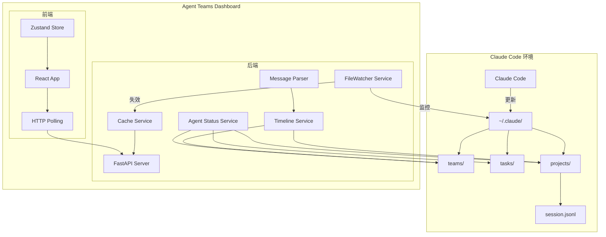
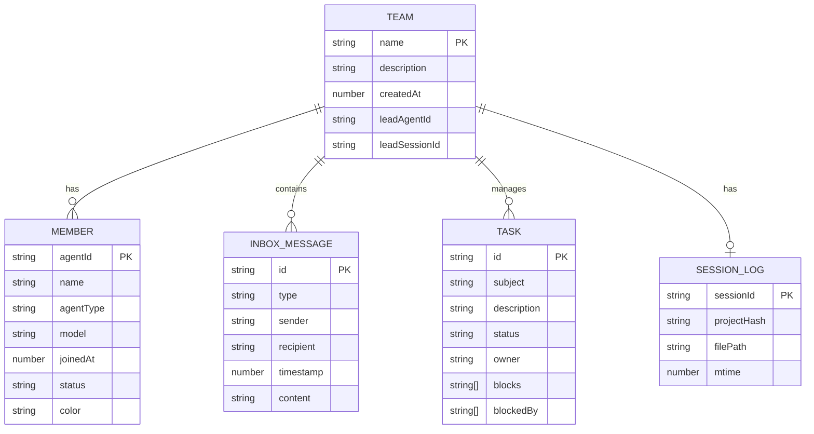

# Agent Teams Dashboard 系统设计文档

---

**语言:** [English](./system-design.en.md) | [日本語](./system-design.md) | [中文](./system-design.zh.md)

---

## 1. 简介

### 1.1 目的

本系统设计文档定义了"Agent Teams Dashboard"应用程序的设计，该应用用于实时监控和管理 Claude Code 的 Agent Teams 功能。

### 1.2 范围

本设计文档涵盖以下范围：

- 后端 API 服务器（FastAPI）
- 前端 Web 应用程序（React + Vite）
- 通过 HTTP 轮询进行实时更新
- 与 Claude Code 数据目录（`~/.claude/`）集成
- 会话日志集成时间线功能
- 团队删除功能

### 1.3 术语定义

| 术语 | 定义 |
|------|------|
| Agent Team | Claude Code 中定义的代理组 |
| Task | 团队内管理的作业单位 |
| Inbox | 代理之间的消息收件箱 |
| Session Log | Claude Code 会话历史（`.jsonl` 文件） |
| Timeline | 集成 inbox + 会话日志的时间序列视图 |
| Protocol Message | 代理间通信的标准消息（task_assignment、idle_notification 等） |
| HTTP Polling | 通过定期 HTTP 请求进行数据更新的方式 |
| FileWatcher | 监控文件系统更改并使缓存失效的服务 |
| CacheService | 使用内存缓存的高速服务 |

---

## 2. 设计思想

### 2.1 为什么采用 HTTP 轮询

**背景与挑战：**
Claude Code 直接更新 `~/.claude/` 下的文件，因此无法进行外部 Push 通知。虽然可以连接 WebSocket，但作为实时更新的主要手段，我们采用 HTTP 轮询。

**选择的方案：**
- 前端以 5-60 秒（默认 30 秒）的间隔进行 HTTP 轮询
- FileWatcher 检测文件更改并**使缓存失效**（非实时 Push）
- 通过缓存减少轮询时的文件访问

**权衡：**
- 实时性会有数秒到数十秒的延迟
- 服务器负载增加，但缓存可减少实际 I/O

### 2.2 为什么基于会话日志的 mtime 判断状态

**背景与挑战：**
为了判断团队的"活跃状态"，之前使用 `config.json` 的 mtime，但它可能会在与团队活动无关的时间被更新。

**选择的方案：**
使用会话日志（`{sessionId}.jsonl`）的 mtime：
- 会话日志记录代理的实际活动（思考、工具执行、文件更改）
- 因此，会话日志的更新时间 = 团队的最后活动时间

**判断逻辑：**
```
1. members 为空 → 'inactive'
2. 没有会话日志 → 'unknown'
3. 会话日志 mtime > 1 小时 → 'stopped'
4. 其他情况 → 'active'
```

### 2.3 为什么引入集成时间线服务

**背景与挑战：**
代理之间的消息（inbox）和会话日志（活动历史）存储在不同的位置，没有统一的视图。

**选择的方案：**
`TimelineService` 集成两者：
- **inbox**：代理之间的任务分配、完成通知、空闲通知
- **会话日志**：思考过程、工具执行、文件更改
- 按时间顺序排序后返回集成时间线

---

## 3. 系统概览

### 3.1 系统架构图



### 3.2 组件列表

| 组件 | 说明 |
|------|------|
| FastAPI Server | 提供 REST API 的后端服务器 |
| FileWatcher Service | 监控 Claude 数据目录的更改，使缓存失效 |
| CacheService | 通过内存缓存（带 TTL）减少文件访问 |
| TimelineService | inbox + 会话日志的集成服务 |
| AgentStatusService | 代理状态推断服务 |
| MessageParser | 协议消息解析服务 |
| React App | 前端应用程序 |
| Zustand Store | 全局状态管理，轮询控制 |
| HTTP Polling | 定期数据更新客户端 |

### 3.3 功能与数据源对应表

| 功能 | 读取目标文件 | 说明 |
|------|-------------|------|
| **团队列表** | `~/.claude/teams/{team_name}/config.json` | 团队设置、成员信息 |
| **团队状态判断** | `~/.claude/projects/{project-hash}/{sessionId}.jsonl` | 基于会话日志 mtime 判断 |
| **收件箱** | `~/.claude/teams/{team_name}/inboxes/{agent_name}.json` | 每个代理的消息收件箱 |
| **任务** | `~/.claude/tasks/{team_name}/{task_id}.json` | 任务定义和状态 |
| **集成时间线** | 以上所有 + 会话日志 | inbox + 会话日志集成 |
| **代理状态** | 任务 + 收件箱 + 会话日志 | 基于状态推断逻辑判断 |

---

## 4. 功能需求

### 4.1 团队监控功能

| 功能 | 说明 |
|------|------|
| 团队列表显示 | 显示所有团队（带状态） |
| 团队详情显示 | 显示特定团队的成员构成和设置 |
| 成员状态 | 显示每个成员的状态（active/idle） |
| 收件箱显示 | 显示团队内的消息收件箱 |
| 团队状态判断 | 基于会话日志 mtime 的四种状态判断 |
| 团队删除 | 删除 stopped/inactive/unknown 状态的团队 |

#### 团队状态判断流程

```
┌─────────────────────────────────────────────────────────┐
│               团队状态判断                                │
├─────────────────────────────────────────────────────────┤
│                                                         │
│  ┌──────────────────┐                                   │
│  │ members 为空？   │                                   │
│  └────────┬─────────┘                                   │
│           │                                             │
│     ┌─────┴─────┐                                       │
│     │ 是        │ 否                                    │
│     ▼           ▼                                       │
│ ┌────────┐  ┌──────────────────────┐                   │
│ │inactive│  │ 会话日志存在？        │                   │
│ └────────┘  └──────────┬───────────┘                   │
│                        │                                │
│                  ┌─────┴─────┐                          │
│                  │ 否        │ 是                       │
│                  ▼           ▼                          │
│              ┌────────┐  ┌─────────────────────┐        │
│              │unknown │  │ mtime > 1 小时？    │        │
│              └────────┘  └──────────┬──────────┘        │
│                                     │                   │
│                               ┌─────┴─────┐             │
│                               │ 是        │ 否           │
│                               ▼           ▼             │
│                           ┌────────┐  ┌────────┐        │
│                           │stopped │  │ active │        │
│                           └────────┘  └────────┘        │
│                                                         │
└─────────────────────────────────────────────────────────┘
```

#### 团队删除功能

**可删除的状态**: `stopped`、`inactive`、`unknown`

**删除的文件**:
1. 整个 `teams/{team_name}/` 目录（config.json、inboxes/）
2. 整个 `tasks/{team_name}/` 目录
3. 仅会话文件（`projects/{hash}/{session}.jsonl`）
   - 项目目录本身保留（可能属于其他团队）

**不可删除**: `active` 状态的团队（400 Bad Request）

### 4.2 任务管理功能

| 功能 | 说明 |
|------|------|
| 任务列表显示 | 显示所有任务或按团队显示任务 |
| 任务详情显示 | 显示任务的描述、状态、依赖关系 |
| 状态显示 | 可视化 pending/in_progress/completed/stopped 状态 |
| 团队筛选 | 仅显示特定团队的任务 |
| 搜索功能 | 按主题/负责人搜索任务 |
| 任务停止判断 | 将 24 小时以上未更新的任务显示为停止状态 |

### 4.3 集成时间线功能

| 功能 | 说明 |
|------|------|
| 时间线显示 | 集成 inbox + 会话日志的时间序列显示 |
| 消息类型显示 | 按类型格式化显示协议消息 |
| 会话日志显示 | 显示思考、工具执行、文件更改 |
| 发送者→接收者显示 | 明确显示消息的发送者和接收者 |
| Markdown 支持 | 格式化显示消息中的 Markdown |
| 日期分隔符 | 按日期分组显示消息 |
| 时间范围筛选 | 仅显示指定时间范围内的消息 |
| 发送者筛选 | 仅显示特定代理的消息 |
| 差异更新 | 使用 since 参数仅获取自上次以来的更改 |

#### 会话日志条目类型

| 类型 | 内容 | 显示图标 |
|------|------|----------|
| `user_message` | 用户输入 | 👤 |
| `assistant_message` | 助手响应 | 🤖 |
| `thinking` | 思考过程 | 💭 |
| `tool_use` | 工具调用 | 🔧 |
| `file_change` | 文件更改 | 📁 |

### 4.4 代理状态推断功能

| 状态 | 判断条件 | 显示 |
|------|---------|------|
| `idle` | 5 分钟以上无活动 | 💤 空闲中 |
| `working` | 有 in_progress 任务 | 🔵 工作中 |
| `waiting` | 有被阻塞的任务 | ⏳ 等待中 |
| `error` | 30 分钟以上无活动 | ❌ 错误 |
| `completed` | 所有任务完成 | ✅ 已完成 |

**状态推断使用的数据**:
- inbox 消息（task_assignment、task_completed 等）
- 任务定义（owner、status、blockedBy）
- 会话日志（最后活动时间、使用的模型）

### 4.5 实时更新功能

| 功能 | 说明 |
|------|------|
| HTTP 轮询 | 以 5-60 秒间隔定期更新数据 |
| 轮询间隔设置 | 用户可配置（5s/10s/20s/30s/60s） |
| 差异更新 | 使用 since 参数减少数据传输 |
| 文件监控 | 检测 Claude 数据目录的更改 |
| 缓存失效 | 通过 FileWatcher 集成自动更新缓存 |

---

## 5. 非功能需求

### 5.1 性能

| 项目 | 要求 |
|------|------|
| API 响应时间 | 500 毫秒以内 |
| 文件监控防抖 | 500 毫秒 |
| 轮询间隔 | 默认 30 秒（可配置：5-60 秒） |
| 缓存 TTL | 配置 30 秒、收件箱 60 秒 |

### 5.2 可用性

| 项目 | 要求 |
|------|------|
| 自动恢复 | 错误后在下次轮询时恢复 |
| 缓存弹性 | 文件访问失败时使用缓存数据 |

### 5.3 安全性

| 项目 | 要求 |
|------|------|
| CORS | 仅允许来自许可来源的通信 |
| 输入验证 | 通过 Pydantic 进行数据验证 |
| 删除保护 | 禁止删除活跃团队 |

### 5.4 可扩展性

| 项目 | 要求 |
|------|------|
| 模块设计 | 按功能分离 |
| 配置管理 | 通过环境变量更改设置 |
| 服务扩展 | 易于向 TimelineService 添加新数据源 |

---

## 6. 外部接口

### 6.1 REST API 列表

> **图例**: ✅ = 前端使用中，❌ = 前端未使用（仅后端已实现），⚠️ = 监控/调试用

#### 健康和系统相关

| 端点 | 方法 | 说明 | 响应 | 使用 |
|------|------|------|------|------|
| `/api/health` | GET | 健康检查 | `{"status": "ok"}` | ⚠️ 监控用 |
| `/api/models` | GET | 获取可用模型列表 | `ModelListResponse` | ❌ 未使用 |
| `/api/cache/stats` | GET | 获取缓存统计信息 | `object` | ❌ 未使用 |

#### 团队相关

| 端点 | 方法 | 说明 | 响应 | 使用 |
|------|------|------|------|------|
| `/api/teams/` | GET | 获取所有团队列表（带状态） | `TeamSummary[]` | ✅ 使用中 |
| `/api/teams/{team_name}` | GET | 获取特定团队详情 | `Team` | ✅ 使用中 |
| `/api/teams/{team_name}` | DELETE | 删除团队（仅 stopped/inactive/unknown） | `DeleteResult` | ✅ 使用中 |
| `/api/teams/{team_name}/inboxes` | GET | 获取团队收件箱 | `object` | ✅ 使用中 |
| `/api/teams/{team_name}/inboxes/{agent_name}` | GET | 获取特定代理的收件箱 | `object` | ✅ 使用中 |

#### 任务相关

| 端点 | 方法 | 说明 | 响应 | 使用 |
|------|------|------|------|------|
| `/api/tasks/` | GET | 获取所有任务列表 | `TaskSummary[]` | ✅ 使用中 |
| `/api/tasks/team/{team_name}` | GET | 获取团队特定任务（详细版） | `Task[]` | ✅ 使用中 |
| `/api/tasks/{task_id}` | GET | 获取特定任务详情（team_name 为查询参数） | `Task` | ❌ 未使用 |

#### 代理相关

| 端点 | 方法 | 说明 | 响应 | 使用 |
|------|------|------|------|------|
| `/api/teams/{team_name}/agents/status` | GET | 获取团队内代理状态 | `AgentStatusList` | ❌ 未使用 |
| `/api/teams/{team_name}/agents/typing` | GET | 获取输入中代理列表 | `TypingIndicators` | ❌ 未使用 |

#### 消息相关

| 端点 | 方法 | 说明 | 响应 | 使用 |
|------|------|------|------|------|
| `/api/teams/{team_name}/messages/timeline` | GET | 获取时间线显示用消息 | `TimelineData` | ✅ 使用中 |
| `/api/teams/{team_name}/messages` | GET | 获取消息列表（原始数据） | `object` | ❌ 未使用 |
| `/api/teams/{team_name}/messages/chat` | GET | 获取聊天格式消息 | `ChatMessageList` | ❌ 未使用 |

#### 集成时间线相关

| 端点 | 方法 | 说明 | 响应 | 使用 |
|------|------|------|------|------|
| `/api/timeline/{team_name}/history` | GET | 获取集成时间线历史 | `UnifiedTimelineResponse` | ✅ 使用中 |
| `/api/timeline/{team_name}/updates` | GET | 获取差异更新（使用 since 参数） | `UnifiedTimelineResponse` | ✅ 使用中 |

> **注意**: 前端未使用的 API（❌）是为将来的功能扩展或外部工具集成而实现的。

### 6.2 查询参数

#### `/api/timeline/{team_name}/history`

| 参数 | 类型 | 必需 | 说明 |
|------|------|------|------|
| `limit` | int | 否 | 最大获取数量（1-10000，默认 100） |
| `types` | string | 否 | 类型筛选器（逗号分隔，例如：message,thinking,tool_use） |
| `before_event_id` | string | 否 | 用于分页（获取比此事件 ID 更早的条目） |

#### `/api/timeline/{team_name}/updates`

| 参数 | 类型 | 必需 | 说明 |
|------|------|------|------|
| `since` | string | 否 | 参考时间（ISO8601 格式，仅获取此时间之后的条目） |
| `limit` | int | 否 | 最大获取数量（1-200，默认 50） |

#### `/api/teams/{team_name}/messages/timeline`

| 参数 | 类型 | 必需 | 说明 |
|------|------|------|------|
| `start_time` | string | 否 | 开始时间（ISO 8601 格式） |
| `end_time` | string | 否 | 结束时间（ISO 8601 格式） |
| `since` | string | 否 | 差异更新用的参考时间（ISO 8601 格式） |
| `senders` | string | 否 | 发送者筛选器（逗号分隔） |
| `types` | string | 否 | 类型筛选器（逗号分隔） |
| `search` | string | 否 | 全文搜索查询 |
| `unread_only` | boolean | 否 | 仅获取未读（默认：false） |
| `limit` | int | 否 | 获取数量上限（最大 500，默认 100） |
| `offset` | int | 否 | 偏移量（默认 0） |

#### `/api/teams/{team_name}/messages/chat`

| 参数 | 类型 | 必需 | 说明 |
|------|------|------|------|
| `start_time` | string | 否 | 开始时间（ISO 8601 格式） |
| `end_time` | string | 否 | 结束时间（ISO 8601 格式） |
| `since` | string | 否 | 差异更新用的参考时间（ISO 8601 格式） |
| `senders` | string | 否 | 发送者筛选器（逗号分隔） |
| `types` | string | 否 | 类型筛选器（逗号分隔） |
| `search` | string | 否 | 全文搜索查询 |
| `unread_only` | boolean | 否 | 仅获取未读（默认：false） |
| `limit` | int | 否 | 获取数量上限（最大 500，默认 100） |
| `offset` | int | 否 | 偏移量（默认 0） |

### 6.3 数据格式

#### Team

```typescript
interface Team {
  name: string;
  description: string;
  createdAt: number;
  leadAgentId: string;
  leadSessionId: string;
  members: Member[];
}

interface TeamSummary {
  name: string;
  description: string;
  memberCount: number;
  taskCount: number;
  status: 'active' | 'inactive' | 'stopped' | 'unknown';
  leadAgentId: string;
  createdAt?: number;
}

interface Member {
  agentId: string;
  name: string;
  agentType: string;
  model: string;
  joinedAt: number;
  status: 'active' | 'idle';
  color?: string;
}
```

#### Task

```typescript
interface Task {
  id: string;
  subject: string;
  description: string;
  activeForm: string;
  status: 'pending' | 'in_progress' | 'completed' | 'deleted' | 'stopped';
  owner: string;
  team: string;
  blocks: string[];
  blockedBy: string[];
  metadata: Record<string, unknown>;
}

interface TaskSummary {
  id: string;
  subject: string;
  status: 'pending' | 'in_progress' | 'completed' | 'deleted' | 'stopped';
  owner: string;
  team: string;
}
```

#### UnifiedTimelineEntry

```typescript
interface UnifiedTimelineEntry {
  id: string;
  content: string;
  from_: string;  // Python 中 from 是保留字，因此使用 from_
  to?: string;
  timestamp: string;
  color?: string;
  read: boolean;
  summary?: string;
  source: 'inbox' | 'session';
  parsed_type: string;
  parsed_data?: Record<string, unknown>;
  details?: Record<string, unknown>;
}

type TimelineMessageType =
  | 'message'
  | 'idle_notification'
  | 'shutdown_request'
  | 'shutdown_response'
  | 'shutdown_approved'
  | 'plan_approval_request'
  | 'plan_approval_response'
  | 'task_assignment'
  | 'task_completed'
  | 'unknown';

type SessionLogType =
  | 'user_message'
  | 'assistant_message'
  | 'thinking';
  // 注意：tool_use 和 file-history-snapshot 在时间线中被排除
```

#### DeleteResult

```typescript
interface DeleteResult {
  message: string;
  deletedPaths: string[];
}
```

#### ChatMessage

```typescript
interface ChatMessage {
  id: string;
  from: string;
  to?: string;
  text: string;
  summary?: string;
  timestamp: string;
  type: string;  // 默认: 'message'
  isPrivate: boolean;  // 默认: false
  visibleTo: string[];  // 默认: []
  read: boolean;  // 默认: false
  color?: string;
}

interface ChatMessageList {
  messages: ChatMessage[];
  count: number;  // 默认: 0
  hasMore: boolean;  // 默认: false
}
```

#### AgentStatus

```typescript
interface AgentStatus {
  name: string;
  status: 'online' | 'idle' | 'offline';
  lastActivity?: string;  // ISO 8601 格式
}

interface AgentStatusList {
  agents: AgentStatus[];  // 默认: []
}
```

#### TypingIndicators

```typescript
interface TypingIndicators {
  typing: string[];  // 默认: []
}
```

#### TimelineData（用于 vis-timeline）

```typescript
interface TimelineData {
  items: TimelineItem[];
  groups: TimelineGroup[];
  timeRange: { [key: string]: string };
  count: number;  // 默认: 0
  total: number;  // 默认: 0
  hasMore: boolean;  // 默认: false
}

interface TimelineItem {
  id: string;
  content: string;
  start: string;
  type: 'box' | 'point';  // 默认: 'box'
  className: string;  // 默认: 'timeline-item'
  group: string;
  receiver?: string;
  data: Record<string, unknown>;
}

interface TimelineGroup {
  id: string;
  content: string;
  className?: string;  // 默认: 'timeline-group'
}
```

#### ModelConfig

```typescript
interface ModelConfig {
  id: string;
  color: string;
  icon: string;
  label: string;
  provider: 'anthropic' | 'moonshot' | 'zhipu' | 'other';
}

interface ModelListResponse {
  models: ModelConfig[];
}
```

---

## 7. 数据设计

### 7.1 数据模型图



### 7.2 文件结构

#### Claude 数据目录

```
~/.claude/
├── teams/
│   └── {team_name}/
│       ├── config.json          # 团队设置
│       │                        # - name, description, members
│       │                        # - leadAgentId, leadSessionId
│       └── inboxes/
│           └── {agent_name}.json # 每个代理的收件箱
├── tasks/
│   └── {team_name}/
│       └── {task_id}.json       # 任务定义
└── projects/
    └── {project-hash}/          # project-hash = "-" + cwd.replace("/", "-")
        └── {sessionId}.jsonl    # 会话历史
```

#### project-hash 转换逻辑

```python
def _cwd_to_project_hash(cwd: str) -> str:
    return "-" + cwd.lstrip("/").replace("/", "-")
```

示例：
- `/Users/user/project` → `-Users-user-project`
- `/home/user/workspace` → `-home-user-workspace`

---

## 8. 错误处理

### 8.1 错误代码列表

| 代码 | 说明 |
|------|------|
| 400 Bad Request | 不可删除的团队（active 状态） |
| 404 Not Found | 未找到资源（团队、任务或收件箱不存在） |
| 500 Internal Server Error | 服务器内部错误 |

### 8.2 异常处理策略

| 层 | 策略 |
|----|------|
| API | 返回适当的 HTTP 状态码和日文错误消息 |
| 文件加载 | 记录读取错误并跳过 |
| 前端 | 在 UI 中显示错误状态，在下次轮询时尝试恢复 |

---

## 9. 技术栈

### 9.1 后端

| 类别 | 技术 | 版本 |
|------|------|------|
| 语言 | Python | 3.11+ |
| 框架 | FastAPI | 0.109.0+ |
| ASGI 服务器 | Uvicorn | 0.27.0+ |
| 数据验证 | Pydantic | 2.5.0+ |
| 文件监控 | watchdog | 4.0.0+ |

### 9.2 前端

| 类别 | 技术 | 版本 |
|------|------|------|
| 语言 | TypeScript | 5.3.0+ |
| 框架 | React | 18.2.0 |
| 打包工具 | Vite | 5.0.0+ |
| CSS | Tailwind CSS | 3.4.0+ |
| 状态管理 | Zustand | 5.0.2+ |
| 数据获取 | TanStack Query | 5.90.21+ |
| 虚拟滚动 | @tanstack/react-virtual | 3.10.8+ |
| Markdown | react-markdown | 10.1.0+ |
| 日期处理 | date-fns | 4.1.0+ |
| 图表可视化 | D3.js | 7.8.5+ |
| 时间线 | vis-timeline | 7.7.3+ |
| UI 组件 | Radix UI | 1.x |
| 图标 | lucide-react | 0.344.0+ |

---

## 10. 配置管理

### 10.1 后端配置

环境变量前缀：`DASHBOARD_`

| 变量名 | 默认值 | 说明 |
|--------|--------|------|
| `DASHBOARD_HOST` | `127.0.0.1` | 服务器监听地址 |
| `DASHBOARD_PORT` | `8000` | 服务器监听端口 |
| `DASHBOARD_DEBUG` | `True` | 调试模式 |
| `DASHBOARD_CLAUDE_DIR` | `~/.claude` | Claude 数据目录 |

### 10.2 前端配置

| 设置 | 值 |
|------|-----|
| 开发服务器端口 | `5173` |
| API 代理 | `/api` → `http://127.0.0.1:8000` |
| 轮询间隔（默认） | `30 秒` |
| 轮询间隔（选项） | `5s, 10s, 20s, 30s, 60s` |

---

## 11. 未来扩展点

| 项目 | 说明 |
|------|------|
| 身份验证/授权 | 添加用户身份验证 |
| 数据库 | 添加持久化存储 |
| E2E 测试 | 实现自动化测试 |
| 日志管理 | 引入结构化日志 |
| 性能监控 | 指标收集功能 |
| ✅ i18n | 多语言支持（已实现） |
| 新数据源 | 将外部日志集成到 TimelineService |

---

## 12. 国际化（i18n）架构

### 12.1 概述

应用程序支持三种语言：日语、英语和中文。前端和后端都实现了 i18n 功能。

### 12.2 前端 i18n

**技术栈：**
| 技术 | 版本 | 用途 |
|------|------|------|
| i18next | 24.2.0+ | 国际化框架 |
| react-i18next | 15.4.0+ | React i18n 绑定 |

**翻译文件结构：**
```
frontend/src/locales/
├── ja/                     # 日语
│   ├── common.json         # 通用翻译
│   ├── dashboard.json      # 仪表板
│   ├── tasks.json          # 任务管理
│   ├── timeline.json       # 时间线
│   ├── errors.json         # 错误消息
│   └── ...                 # 其他模块
├── en/                     # 英语
│   └── ...（相同结构）
└── zh/                     # 中文
    └── ...（相同结构）
```

**语言检测优先级：**
1. **localStorage**：保存在 `i18nextLng` 键中的语言设置
2. **浏览器设置**：`navigator.language`
3. **默认值**：日语（`ja`）

**使用示例：**
```tsx
import { useTranslation } from 'react-i18next';

function TeamCard({ team }: { team: TeamSummary }) {
  const { t } = useTranslation();

  return (
    <div>
      <h3>{team.name}</h3>
      <span>{t(`common.status.${team.status}`)}</span>
    </div>
  );
}
```

### 12.3 后端 i18n

**架构：**
后端实现了自定义轻量级 i18n 服务，用于多语言 API 错误消息和日志消息。

**翻译文件结构：**
```
backend/locales/
├── ja/                     # 日语
│   ├── api.json            # API 错误消息
│   └── logs.json           # 日志消息
├── en/                     # 英语
│   ├── api.json
│   └── logs.json
└── zh/                     # 中文
    ├── api.json
    └── logs.json
```

**语言检测中间件：**

`LanguageMiddleware` 按以下优先级检测语言：

1. **Accept-Language 请求头**：HTTP 请求头
2. **默认语言**：`DASHBOARD_DEFAULT_LANGUAGE` 设置

```python
# app/middleware/language.py
class LanguageMiddleware:
    async def dispatch(self, request: Request, call_next):
        # 从 Accept-Language 请求头获取语言
        accept_language = request.headers.get("Accept-Language", "ja")
        language = self._parse_accept_language(accept_language)

        # 保存到请求状态
        request.state.language = language

        response = await call_next(request)
        return response
```

**I18nService：**
```python
# app/services/i18n_service.py
class I18nService:
    def __init__(self, locales_dir: Path, default_language: str = "ja"):
        self._translations: dict[str, dict] = {}
        self._default_language = default_language
        self._load_translations(locales_dir)

    def t(self, key: str, language: str, **kwargs) -> str:
        """获取翻译键对应的翻译文本"""
        translation = self._get_nested_value(
            self._translations.get(language, {}),
            key
        )
        return translation.format(**kwargs) if translation else key
```

### 12.4 支持的语言

| 语言代码 | 语言名称 |
|---------|---------|
| `ja` | 日本語（默认） |
| `en` | English |
| `zh` | 中文 |

### 12.5 环境变量

| 变量 | 默认值 | 说明 |
|------|--------|------|
| `DASHBOARD_DEFAULT_LANGUAGE` | `ja` | 默认语言（ja/en/zh） |

### 12.6 翻译键一致性检查

`scripts/verify-translations.js` 脚本通过 pre-commit 钩子自动运行，用于验证所有语言之间的翻译键一致性。

---

*创建日期: 2026-02-16*
*最后更新日期: 2026-03-04*
*版本: 2.2.0*
